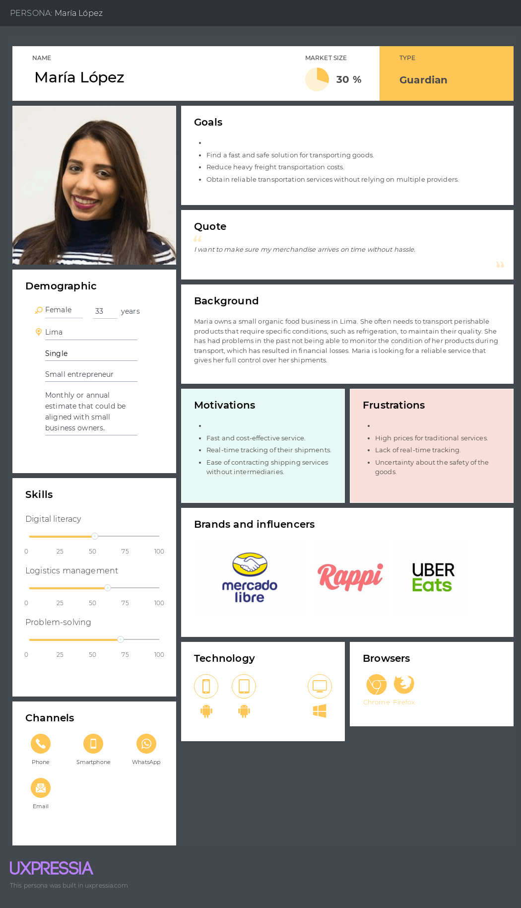
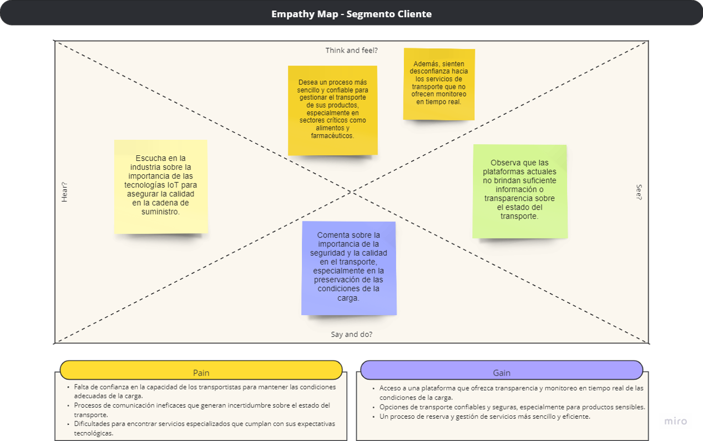

  

<h3 align="center"> Universidad Peruana de Ciencias Aplicadas</h3>

<h4 align="center"> Ingeniería de Software  </h4>

<h4 align="center"> Desarrollo de Soluciones IOT </h4>

<h4 align="center"> Informe de Trabajo Final </h4>
<h4 align="center">Ciclo: VII </h4>
<h5 align="center">Sección: WS71</h5>

<h5 align="center">Profesor: Angel Augusto Velasquez Nuñez</h5>

<h3 align="center">Startup: "Castores Rabiosos"</h2>
  
<h4 align="center">Producto: TransportApp</h3>

| Integrantes                       | Codigo     |
| --------------------------------- | ---------- |
| Abanto Vicente, Edery Renzo       | U201822832 |
| Castro Soto, Sebastian Enrique    | U20181C241 |
| Conde Isla, Camila Alessandra     | U202114309 |
| Portales Ortiz, Diego Alejandro   | U202123501 |
| Sabino Ramírez, Rodrigo Alexander | U20201B801 |

<h4 align="center">Agosto, 2024</h3>

---
# Registro de Versiones del Informe

| Versión | Fecha    | Autor                | Descripción de modificación                             |
| ------- | -------- | -------------------- | ------------------------------------------------------- |
| 1.0     | 27/08/24 | - Rodrigo Sabino  | Se creó el archivo README.md con la estructura inicial. |

---
# Project Report Collaboration Insights

Este apartado tiene como objetivo describir la colaboración del equipo a lo largo del proyecto, resaltando cómo se distribuyeron y gestionaron las tareas durante las distintas fases del desarrollo. A continuación, se proporcionan capturas de pantalla de las interacciones y aportaciones realizadas en el repositorio de GitHub para cada una de las entregas clave, así como el enlace directo al repositorio.

#### Repositorio de GitHub
El repositorio utilizado para gestionar las versiones del código y realizar los reportes de cada entrega es accesible en el siguiente enlace:: [https://github.com/upc-pre-202402-si572-ws71-Castores/upc-pre-202402-si572-ws71-CastoresRabiosos-report](https://github.com/upc-pre-202402-si572-ws71-Castores/upc-pre-202402-si572-ws71-CastoresRabiosos-report)
 
#### Colaboración por entregables
_**TB1**_
En el primer entregable, TB1, se establecieron las bases del proyecto con una introducción a la startup y sus integrantes, describiendo su perfil, misión, visión y las habilidades de cada miembro. También se realizó un análisis de los antecedentes y la problemática a resolver utilizando Lean UX, lo que permitió identificar problemas, formular suposiciones y plantear hipótesis para guiar el diseño del producto. Se elaboró un Lean UX Canvas para organizar objetivos, segmentos objetivo y métricas de éxito. Finalmente, se analizó el mercado y los competidores, identificando oportunidades para diferenciar nuestra solución. 

A continuación, se presenta el flujo de trabajo:

 
---

# Contenido
- [Student Outcome](#student-outcome)
- [Capítulo I: Introducción](#capítulo-i-introducción)
  - [1.1. Startup Profile](#11-startup-profile)
    - [1.1.1. Descripción de la Startup](#111-descripción-de-la-startup)
    - [1.1.2. Perfiles de integrantes del equipo](#112-perfiles-de-integrantes-del-equipo)
  - [1.2. Solution Profile](#12-solution-profile)
    - [1.2.1. Antecedentes y Problemática](#121-antecedentes-y-problemática)
    - [1.2.2. Lean UX Process](#122-lean-ux-process)
        - [1.2.2.1.  Lean UX Problem Statements](#1221-lean-ux-problem-statements)
        - [1.2.2.2 Lean UX Assumptions](#1222-lean-ux-assumptions)
        - [1.2.2.3. Lean UX Hypothesis Statements](#1223-lean-ux-hypothesis-statements)
        - [1.2.2.4. Lean UX Canvas](#1224-lean-ux-canvas)
  - [1.3. Segmentos Objetivo](#13-segmentos-objetivo)
- [Capítulo II: Requirements Elicitation & Analysis](#capítulo-ii-requirements-elicitation--analysis)
  - [2.1. Competidores](#211-competidores)
    - [2.1.1. Análisis Competitivo](#211-análisis-competitivo)
    - [2.1.2. Estrategias y tácticas frente a competidores](#212-estrategias-y-tácticas-frente-a-competidores)
  - [2.2. Entrevistas](#22-entrevistas)
    - [2.2.1. Diseño de entrevistas](#221-diseño-de-entrevistas)
    - [2.2.2. Registro de entrevistas](#222-registro-de-entrevistas)
    - [2.2.3. Análisis de entrevistas](#223-análisis-de-entrevistas)
  - [2.3. Needfinding](#23-needfinding)
    - [2.3.1. User Personas](#231-user-personas)
    - [2.3.2. User Task Matrix](#232-user-task-matrix)
    - [2.3.3. User Journey Mapping](#233-user-journey-mapping)
    - [2.3.4. Empathy Mapping](#234-empathy-mapping)
    - [2.3.5. As-is Scenario Mapping](#235-as-is-scenario-mapping)
  - [2.4. Ubiquitous Language](#24-ubiquitous-language)
- [Capítulo III: Requirements Specification](#capítulo-iii-requirements-specification)
  - [3.1. To-Be Scenario Mapping](#31-to-be-scenario-mapping)
  - [3.2. User Stories](#32-user-stories)
  - [3.3. Impact Mapping](#33-impact-mapping)
  - [3.4. Product Backlog](#34-product-backlog)
- [Capítulo IV: Solution Software Design](#capítulo-iv-solution-software-design)
  - [4.1. Strategic-Level Domain-Driven Design](#41-strategic-level-domain-driven-design)
	- [4.1.1. EventStorming](#411-eventstorming)
		- [4.1.1.1. Candidate Context Discovery](#4111-candidate-context-discovery)
		- [4.1.1.2 Domain Message Flows Modeling](#4112-domain-message-flows-modeling)
		- [4.1.1.3 Bounded Context Canvases](#4113-bounded-context-canvases)
	- [4.1.2 Context Mapping](#412-context-mapping)
	- [4.1.3. Software Architecture](#413-software-architecture)
		- [4.3.1. Software Architecture System Landscape Diagram](#431-software-architecture-system-landscape-diagram)
		- [4.3.2. Software Architecture Context Level Diagrams](#432-software-architecture-context-level-diagrams)
		- [4.3.3 Software Architecture Container Level Diagrams](#433-software-architecture-container-level-diagrams)
		- [4.3.4 Software Architecture Deployment Diagrams](#434-software-architecture-deployment-diagrams)

- [Capítulo VI: Product Implementation, Validation & Deployment](#capítulo-vi-product-implementation-validation-deployment)
  - [6.1. Software Configuration Management](#61-software-configuration-management)
	- [6.1.1. Software Development Environment Configuration](#611-software-development-environment-configuration)
	- [6.1.2. Source Code Management](#612-source-code-management)
	- [6.1.3. Source Code Style Guide & Management](#613-source-code-style-guide-management)
	- [6.1.4. Software Deployment Configuration](#614-software-deployment-configuration)
  - [6.2. Landing Page, Services & Applications Implementation](#62-landing-page-services-&-applications-implementation)
	- [6.2.1. Sprint 1](#621-sprint-1)
	- [6.2.1.1. Sprint Planning 1](#6211-sprint-planning-1)
	- [6.2.1.2. Sprint Backlog 1](#6212-sprint-backlog-1)
	- [6.2.1.3. Development Evidence for Sprint Review](#6213-development-evidence-for-sprint-review)
	- [6.2.1.4. Testing Suite Evidence for Sprint Review](#6214-testing-suite-evidence-for-sprint-review)
	- [6.2.1.5. Execution Evidence for Sprint Review](#6215-execution-evidence-for-sprint-review)
	- [6.2.1.6. Services Documentation Evidence for Sprint Review](#6216-services-documentation-evidence-for-sprint-review)
	- [6.2.1.7. Software Deployment Evidence for Sprint Review](#6217-software-deployment-evidence-for-sprint-review)

---
# Student Outcome

| Criterio específico                                                                             | Acciones realizadas                                                                                                                                                                                                                                                                                                                                                                                                                                                                                                                                                                                                                                                                                                                                                                                                                                                                                                                                                                                                                                                                                                                                                                                                                                                                                                                                                                                                                                                                                                                                                                                                                                                                                                                           | Conclusiones                                                                                                                                                                                                                                                                                                                                        |
| ----------------------------------------------------------------------------------------------- | --------------------------------------------------------------------------------------------------------------------------------------------------------------------------------------------------------------------------------------------------------------------------------------------------------------------------------------------------------------------------------------------------------------------------------------------------------------------------------------------------------------------------------------------------------------------------------------------------------------------------------------------------------------------------------------------------------------------------------------------------------------------------------------------------------------------------------------------------------------------------------------------------------------------------------------------------------------------------------------------------------------------------------------------------------------------------------------------------------------------------------------------------------------------------------------------------------------------------------------------------------------------------------------------------------------------------------------------------------------------------------------------------------------------------------------------------------------------------------------------------------------------------------------------------------------------------------------------------------------------------------------------------------------------------------------------------------------------------------------------- | --------------------------------------------------------------------------------------------------------------------------------------------------------------------------------------------------------------------------------------------------------------------------------------------------------------------------------------------------- |
| Trabaja en equipo para proporcionar liderazgo en forma conjunta                                 | **Rodrigo Sabino** _TB1:_ Asumí el liderazgo en la organización de las secciones asignadas de los capítulos I y II. Además, propuse utilizar Trello para coordinar las tareas y asegurar que todos tuvieran visibilidad sobre el avance de cada sección del proyecto. Trabajé en conjunto con el equipo para definir las estrategias de Lean UX y organizar las entrevistas con usuarios.  **Edery Abanto**  _TB1:_ Me encargué de la documentación y de coordinar las reuniones grupales a través de Discord, asegurándome de que todos los miembros tuvieran espacio para discutir ideas y resolver dudas. También participé activamente en las reuniones aportando ideas de mejora continua para las soluciones propuestas.  **Sebastian Castro** Colaboré en la creación de los diagramas de clase y de base de datos, trabajando estrechamente con los demás miembros para integrar sus comentarios. También propuse un esquema de reuniones semanales para mantener el flujo de trabajo organizado y asegurar el cumplimiento de los plazos.  **Camila Conde** _TB1:_ Contribuí a las discusiones del equipo proponiendo mejoras en las estrategias presentadas. Además, coordiné el uso de un grupo de WhatsApp para la comunicación rápida y la resolución de problemas en tiempo real entre todos los miembros.  **Diego Portales**  _TB1:_ Realicé entrevistas para el segmento Transportista y aseguré que la documentación estuviera bien estructurada para el equipo. Además, lideré la creación de un documento compartido en Google Docs para centralizar la información y asegurar que todos pudieran trabajar colaborativamente en los mismos documentos.                 | En la fase inicial del proyecto, se presentó una visión general de las ideas y objetivos. La colaboración fue esencial para coordinar tareas a través de herramientas como Trello, Discord y Google Docs, lo que mejoró la organización del equipo. Este enfoque colaborativo permitirá que el equipo avance de manera más estructurada y efectiva. |
| Crea un entorno colaborativo e inclusivo, establece metas, planifica tareas y cumple objetivos. | **Rodrigo Sabino** _TB1:_ Fomenté un entorno inclusivo al establecer metas claras para cada sección y planificar tareas en conjunto con el equipo. Usamos Trello para organizar el trabajo y aseguré que todos los miembros tuvieran responsabilidades bien distribuidas. Participé activamente en las reuniones grupales para garantizar que todos tuvieran voz en la toma de decisiones clave.  **Edery Abanto**  _TB1:_ Me encargué de coordinar las reuniones por Discord y proponer un horario flexible que se adaptara a las necesidades de todos los miembros del equipo. Fomenté la comunicación abierta y la colaboración en todas las fases del proyecto.  **Sebastian Castro** _TB1:_ Ayudé en la planificación de las tareas al proponer un calendario de reuniones semanales, asegurándome de que el equipo se mantuviera al día con los plazos. También trabajé en estrecha colaboración con mis compañeros para resolver problemas técnicos y mejorar el diseño de las soluciones propuestas.  **Camila Conde** _TB1: Participé activamente en las reuniones y propuse la creación de un grupo de WhatsApp para facilitar la comunicación rápida entre el equipo, permitiendo resolver dudas y problemas de manera más eficiente. También aseguré que las tareas estuvieran alineadas con los objetivos del proyecto.  **Diego Portales**  _TB1:_ Propuse el uso de Google Docs para la edición colaborativa de los documentos del proyecto, lo que permitió a todos los miembros trabajar de manera conjunta en tiempo real. Además, ayudé en la organización de las tareas técnicas dentro del equipo para asegurar que se cumplieran los objetivos en tiempo y forma. |  Durante la fase inicial del proyecto, el equipo adoptó herramientas como Trello, Discord y Google Docs para fomentar la colaboración y la organización. Esta estructura nos permitió establecer metas claras y cumplir con los objetivos de manera eficiente, asegurando un entorno de trabajo inclusivo y colaborativo.                        |

---

# Capítulo I: Introducción

## 1.1. Startup Profile
En esta sección se presenta el perfil de la startup que está desarrollando TransportApp. Se describen los orígenes de la empresa, su visión, misión y los objetivos principales que busca alcanzar. El perfil de la startup ofrece una visión general del entorno en el que se desarrolla el proyecto, proporcionando contexto sobre la estructura organizacional y las metas estratégicas de la empresa.
### 1.1.1. Descripción de la Startup

Somos un grupo de estudiantes de la Universidad Peruana de Ciencias Aplicadas que, al identificar una oportunidad en el sector transporte, hemos decidido enfocarnos en mejorar el proceso de transporte de mercadería y bienes diversos a través de soluciones tecnológicas avanzadas.

Nos dimos cuenta de que, para los clientes que requieren servicios de transporte, como el envío de mercadería, mudanzas, o el transporte de productos sensibles, encontrar un servicio confiable y adecuado no es una tarea sencilla. Las dificultades incluyen la falta de contactos, la inseguridad sobre la confiabilidad del servicio, y la falta de opciones adecuadas. Este problema se agrava para clientes que necesitan monitoreo en tiempo real de las condiciones de transporte, como la temperatura, el peso o la ubicación del envío.

Por otro lado, sabemos que existen transportistas independientes y pequeñas empresas que brindan estos servicios, pero a menudo tienen dificultades para expandir su base de clientes más allá de su entorno inmediato. Esto limita sus oportunidades de negocio y reduce la eficiencia operativa, ya que muchos no cuentan con las herramientas necesarias para ofrecer un servicio que cumpla con las expectativas de un mercado cada vez más exigente.

Por lo tanto, hemos creado **TransportApp**, una plataforma que conecta a transportistas con personas o empresas que requieren servicios de transporte especializado. A través de TransportApp, los transportistas pueden registrarse, completar su perfil con información detallada sobre sus servicios, vehículos, permisos, y área de operación. También podrán beneficiarse de la integración de soluciones IoT, como el monitoreo de temperatura, peso, y la ubicación en tiempo real, que les permitirá ofrecer un servicio más confiable y adaptado a las necesidades de sus clientes.

Por su parte, los clientes pueden buscar transportistas según sus necesidades específicas, visualizar la disponibilidad de vehículos, revisar reseñas de otros usuarios, y asegurar que el servicio contratado cumpla con los requisitos necesarios, como el control de temperatura para productos sensibles. Además, la plataforma facilita el proceso de pago de manera segura y eficiente, permitiendo a ambas partes realizar transacciones de manera rápida y confiable.

#### MISIÓN

Facilitar y hacer confiable el proceso de búsqueda y contratación de servicios de transporte especializado para mercadería y bienes, brindando soluciones tecnológicas que aseguren la seguridad y eficiencia en cada envío.

#### VISIÓN

Convertirnos en la plataforma preferida en Perú para la búsqueda y gestión de servicios de transporte especializado, superando constantemente las expectativas de nuestros clientes y contribuyendo al crecimiento del sector transporte a través de la innovación tecnológica.

### 1.1.2. Perfiles de integrantes del equipo

Aquí se describen los perfiles de los miembros clave del equipo involucrado en el desarrollo de TransportApp. Se incluye información sobre sus roles, habilidades, experiencia previa y cómo contribuyen al éxito del proyecto. Esta información es vital para demostrar que el equipo cuenta con las competencias necesarias para llevar a cabo el desarrollo de la solución propuesta.

| Integrante                                                                                                                                                                                                                                                                                                                                                   | Abanto Vicente, Edery Renzo                             |
| ------------------------------------------------------------------------------------------------------------------------------------------------------------------------------------------------------------------------------------------------------------------------------------------------------------------------------------------------------------ | ------------------------------------------------------- |
| Estudiante de Ingeniería de Software en el séptimo ciclo, apasionado por el desarrollo tecnológico. Mi formación sólida y experiencia en proyectos universitarios me capacitan para enfrentar desafíos en entornos profesionales dinámicos. Comprometido con la excelencia y la innovación, estoy listo para contribuir al mundo del desarrollo de software. |  |

| Integrante  | Castro Soto, Sebastian Enrique                                   |
| ----------- | ---------------------------------------------------------------- |
| Universitario con la edad de 23 años y actualmente estudiante de la carrera de Ingeniería de Software en la UPC. Me considero proactivo, responsable y adaptable. En mis ratos libres me gusta pintar, leer, y megusta estudiar escuchando música. |  |

| Integrante  | Conde Isla, Camila Alessandra                              |
| ----------- | ---------------------------------------------------------- |
| Soy estudiante de la carrera de Ingeniería de Software. Mi motivación para seguir aprendiendo es llegar a crear y diseñar soluciones creativas. Me considero una persona creativa, proactiva, tolerante, respetuosa y apasionada por lo que me gusta. Me comprometo a apoyar en el proceso para poder tener un proyecto final bien planteado para obtener una buena nota.|  |

| Integrante                                                                                                                                                                                                                                                                                                                                                                                                                                 | Portales Ortiz, Diego Alejandro                          |
| ------------------------------------------------------------------------------------------------------------------------------------------------------------------------------------------------------------------------------------------------------------------------------------------------------------------------------------------------------------------------------------------------------------------------------------------ | -------------------------------------------------------- |
| Estudiante del séptimo ciclo de la carrera de Ingeniería de Software. Tengo experiencia en varios lenguajes de programación, incluyendo Python, C++, C# y JavaScript. Me destaco por mi capacidad para trabajar en equipo y contribuir activamente en los proyectos en los que participo. Estoy comprometido a aportar de manera eficiente e innovadora no sólo a mi equipo, si no también a la misma rama de estudio a la que pertenezco. |  |

| Integrante                                                                                                                                                                                                                                                                                                                                                                                                                   | Sabino Ramírez, Rodrigo Alexander                            |
| ---------------------------------------------------------------------------------------------------------------------------------------------------------------------------------------------------------------------------------------------------------------------------------------------------------------------------------------------------------------------------------------------------------------------------- | ------------------------------------------------------------ |
| Soy estudiante de octavo ciclo de Ingeniería de Software, con experiencia en desarrollo web, mobile con Flutter, y backend con Java Spring Boot. Me considero proactivo y estratégico, con habilidades en programación y un gran espíritu investigador. Puedo contribuir al proyecto aplicando mis conocimientos técnicos y apoyando al equipo con habilidades blandas como el trabajo en equipo y la comunicación efectiva. |  |

## 1.2. Solution Profile

El producto que proponemos como equipo es **TransportApp**, una aplicación que conecta a transportistas con personas o empresas que requieren de servicios de transporte especializado. Esta solución permite a los usuarios acceder de manera sencilla, segura y eficiente a transportistas que ofrecen monitoreo en tiempo real de condiciones críticas como la temperatura, el peso de la carga. Con TransportApp, tanto clientes como transportistas pueden gestionar sus necesidades de transporte con total confianza, optimizando el proceso y garantizando la integridad de los productos durante todo el trayecto.
### 1.2.1. Antecedentes y Problemática

Esta subsección ofrece una visión general de los antecedentes que llevaron a la identificación del problema que TransportApp pretende solucionar. Se exploran los desafíos actuales en el mercado de transporte y monitoreo de vehículos, y cómo estos afectan a los clientes potenciales. La descripción de la problemática es fundamental para justificar la necesidad de la solución y para guiar el enfoque del desarrollo.
##### ANTECEDENTES:

En el contexto del transporte de carga y mercadería, la evolución de la tecnología ha permitido el surgimiento de diversas plataformas que buscan optimizar la gestión y el monitoreo de estos servicios. A continuación, se presentan los antecedentes de TransportApp en relación con tres empresas relevantes en el sector: 

* **MiCargaApp**: Es una plataforma peruana que facilita la conexión entre transportistas y empresas que necesitan servicios de transporte de carga. Aunque permite el seguimiento de envíos, carece de la integración avanzada de tecnologías IoT. TransportApp se diferencia al ofrecer monitoreo en tiempo real, asegurando que la mercadería se mantenga en condiciones óptimas durante el transporte a través de sensores de temperatura, peso y GPS.

* **SafetyCulture:** a través de su aplicación iAuditor, se ha destacado por mejorar la seguridad y el control en operaciones logísticas mediante listas de verificación y auditorías en tiempo real. Aunque no se centra exclusivamente en el transporte de mercadería, su enfoque en la seguridad es un aspecto que TransportApp adopta, pero con un enfoque específico en el transporte de carga, utilizando sensores IoT para monitorear condiciones críticas como temperatura, peso y ubicación.

* **TSO Mobile:** ofrece soluciones de rastreo y monitoreo en tiempo real para flotas de vehículos, mejorando la eficiencia y seguridad en el transporte. TransportApp se inspira en estas capacidades, pero amplía la oferta al integrar también sensores que monitorean la temperatura y el peso de la carga, proporcionando una solución integral para el transporte de mercadería.

##### PROBLEMÁTICA:

- **What (Qué)** Actualmente, existen muchas aplicaciones de transporte, pero la mayoría están enfocadas en el transporte de personas en entornos urbanos y no en el transporte de mercadería o carga que requiere monitoreo en tiempo real de condiciones críticas como temperatura, peso, y ubicación. TransportApp se especializa en ofrecer una solución para el transporte de carga, facilitando el proceso tanto para transportistas como para clientes, y garantizando un servicio seguro y adecuado para mercadería que necesita condiciones controladas.

- **When (Cuándo)** La problemática surge cuando una persona o empresa necesita un servicio de transporte capaz de manejar cargas específicas, como mercadería que debe mantenerse a una temperatura constante o cuyo peso debe ser monitoreado durante el trayecto. Las opciones existentes no satisfacen estas necesidades especializadas, dejando a los clientes sin soluciones claras.

- **Where (Dónde)** TransportApp se implementará inicialmente en Lima, con el objetivo de expandirse a nivel nacional en el futuro. Nos enfocaremos primero en la capital para consolidar nuestro servicio y luego expandirnos a otras regiones del Perú.

- **Who (Quién)** TransportApp está dirigida a personas y empresas que necesitan un servicio de transporte de carga especializado con monitoreo en tiempo real, así como a transportistas independientes y pequeñas empresas que buscan ampliar su base de clientes y mejorar sus ingresos mediante el uso de tecnología IoT.

- **Why (Por qué)** TransportApp responde a la necesidad de una plataforma que permita a los transportistas ofrecer servicios de transporte de carga que van más allá de lo que las aplicaciones convencionales pueden proporcionar. Los clientes tendrán acceso a opciones especializadas para el transporte de mercadería, con la seguridad de que sus envíos serán monitoreados en tiempo real para asegurar su integridad.

- **How (Cómo)** TransportApp permitirá que los transportistas se registren, proporcionen información sobre sus vehículos y servicios, e integren sensores IoT para monitorear las condiciones de la carga. Los clientes podrán buscar transportistas según sus necesidades, ver reseñas y detalles del servicio, y realizar pagos de manera segura. Durante el transporte, tanto el cliente como el transportista podrán monitorear en tiempo real las condiciones del envío.

- **How Much (Cuánto)** En el Perú, hay pocas aplicaciones que compitan directamente con TransportApp en el ámbito del transporte de carga con capacidades de monitoreo IoT. TransportApp cubrirá una amplia gama de necesidades, desde pequeñas cargas hasta envíos de mercadería que requieren un manejo especializado y monitoreo constante.

### 1.2.2. Lean UX Process
En esta subsección se describe el proceso de Lean UX aplicado durante el desarrollo de TransportApp. Lean UX es una metodología que enfatiza la colaboración y el enfoque en el usuario final a través de ciclos iterativos de diseño y validación. Se detallan las diferentes etapas del proceso y cómo contribuyen a crear una solución que realmente resuelva los problemas identificados.
#### 1.2.2.1. Lean UX Problem Statements

En esta sección, se presentan los _problem statements_ clave identificados para el desarrollo de _TransportApp_. Estos enunciados buscan describir las principales problemáticas que enfrenta el sector del transporte de carga y los desafíos que enfrentan los transportistas independientes. A través del análisis de estas necesidades, se propone el desarrollo de una plataforma integral que integre tecnología IoT para mejorar la seguridad, eficiencia y confiabilidad en el transporte de mercancías, empoderando a los transportistas y ofreciendo mejores soluciones a empresarios y personas naturales.

##### Problem Statement 1: Transporte de mercancías y carga

El transporte de mercancías y carga es una actividad esencial para empresarios y personas naturales que necesitan trasladar productos de manera segura y eficiente. A pesar de la existencia de plataformas de transporte, estas se enfocan principalmente en el ámbito urbano y en el transporte de personas, lo que no satisface las necesidades específicas del transporte de carga.

El transporte de carga enfrenta desafíos particulares, como el monitoreo de condiciones esenciales para ciertos tipos de mercancía, como la temperatura, el peso y la ubicación. Además, la confianza y seguridad en la información proporcionada por estas plataformas son preocupaciones constantes para los usuarios.

Se necesita desarrollar una plataforma integral que permita a empresarios y personas naturales acceder a servicios de transporte de carga especializados, con monitoreo en tiempo real de las condiciones esenciales de sus productos durante el transporte, garantizando la seguridad y la confiabilidad de la información.

¿Cómo podemos desarrollar una plataforma integral que aborde las necesidades del transporte de carga, proporcionando monitoreo en tiempo real de temperatura, peso y ubicación, mientras garantizamos la seguridad y confiabilidad de la información?

##### Problem Statement 2: Empoderamiento de transportistas independientes

Los transportistas independientes y pequeños empresarios desempeñan un papel clave en la economía del transporte de carga, pero a menudo carecen de oportunidades para expandir su negocio y conectar con un público más amplio.

Actualmente no existe una plataforma confiable que permita a estos transportistas ofrecer servicios de transporte especializado, aumentar su visibilidad y generar ingresos adicionales, lo que limita su crecimiento y sostenibilidad en el mercado.

Se busca empoderar a los transportistas independientes mediante una plataforma que integre tecnología IoT, facilitando la oferta de servicios especializados de manera confiable, y garantizando la calidad y seguridad en los servicios ofrecidos.

¿Cómo podemos empoderar a los transportistas independientes para que expandan su negocio mediante una plataforma que integre tecnología IoT y garantice la seguridad, calidad y eficiencia en los servicios de transporte de carga?

#### 1.2.2.2. Lean UX Assumptions
En esta subsección se documentan las suposiciones clave realizadas durante el proceso de diseño. Estas suposiciones incluyen creencias sobre las necesidades de los usuarios, sus comportamientos, y cómo la solución propuesta podría satisfacer esas necesidades. Las suposiciones sirven como base para las hipótesis que serán validadas o refutadas durante el proceso de desarrollo.

##### CARACTERÍSTICAS

- Registro de usuarios, diferenciando claramente entre transportistas y clientes.
- Visualización de perfiles detallados de los transportistas, que incluirán información relevante para el servicio, fotos del vehículo, y capacidades tecnológicas como la disponibilidad de sensores de peso y temperatura en sus vehículos.
- Los clientes podrán ver la reputación del transportista, medida a través de un sistema de calificación por estrellas y comentarios de clientes anteriores.
- Para contratar un servicio, los clientes deberán completar un formulario con detalles del servicio, como la fecha, hora, lugar, tipo de servicio, origen, destino, peso de la carga (verificado mediante sensores), monto a pagar, y una descripción adicional.
- Los transportistas recibirán notificaciones de solicitudes de servicio, pudiendo aceptar o rechazar según su disponibilidad y capacidad.
- Pago del servicio de forma online, liberando el pago al transportista una vez finalizado el servicio y verificado el correcto manejo de la carga.
- Historial de servicios tanto para transportistas (servicios brindados) como para clientes (servicios contratados), con registro de condiciones monitoreadas (peso y temperatura) durante el transporte.
- Monitoreo en tiempo real de la ubicación del transporte mediante tecnología GPS, así como de las condiciones de la carga (peso y temperatura) a través de sensores IoT.
- Filtros para que los clientes seleccionen el tipo de transporte que necesitan, basándose en las capacidades tecnológicas disponibles (sensores de peso, temperatura, tipo de vehículo).

##### BUSINESS OUTCOMES

- Aumentar las opciones de transporte disponibles para los clientes, asegurando que las cargas sean manejadas en condiciones óptimas.
- Proporcionar seguridad a los usuarios en el proceso de pago y en la elección de un transportista con las capacidades tecnológicas adecuadas.
- Garantizar que los transportistas reciban pagos seguros y que disfruten de una plataforma confiable para ofrecer sus servicios especializados.
- Fomentar el uso de la plataforma, atrayendo más usuarios gracias a las ventajas tecnológicas que ofrece en el monitoreo de cargas.

##### BENEFICIOS DEL USUARIO

- Los transportistas podrán aumentar su base de clientes y mejorar sus ingresos, ofreciendo servicios con valor añadido gracias al monitoreo en tiempo real de peso y temperatura.
- Los clientes tendrán acceso a más opciones de transporte, pudiendo elegir servicios que garanticen la integridad de su carga mediante el uso de sensores IoT.
- Los clientes podrán evitar la búsqueda dispersa de servicios de transporte, accediendo a una plataforma centralizada que ofrece opciones seguras y confiables.
- Los clientes podrán monitorear en tiempo real no solo la ubicación de su transporte, sino también las condiciones de su carga, asegurando que se mantenga dentro de los parámetros establecidos.
- Los usuarios podrán compartir sus experiencias y opiniones en un foro comunitario, ayudando a mejorar continuamente la plataforma.

##### BUSINESS ASSUMPTIONS

- Creemos que los usuarios desean un entorno seguro donde transportistas y clientes puedan conectarse, sabiendo que la carga será transportada en condiciones óptimas gracias al monitoreo de peso y temperatura.
- Los transportistas buscan una plataforma donde puedan ofrecer sus servicios especializados, utilizando tecnología IoT para aumentar su competitividad y atraer más clientes.
- Los usuarios valoran la veracidad de la información proporcionada, así como la seguridad en las transacciones y el monitoreo en tiempo real de las condiciones de su carga.
- Estas necesidades se pueden resolver con una aplicación que conecte a transportistas y clientes, ofreciendo un servicio seguro y personalizado con capacidades tecnológicas avanzadas.
- Los usuarios iniciales serán transportistas que ofrecen servicios de transporte de carga especializada, donde el monitoreo de peso y temperatura es crucial.
- El principal valor que los usuarios buscan en la aplicación es la confiabilidad, la seguridad, y la capacidad de garantizar que la carga sea manejada en condiciones óptimas.
- Atraeremos clientes mediante anuncios dirigidos cuando busquen servicios de transporte de carga en internet, destacando las capacidades tecnológicas de la plataforma.
- Generaremos ingresos a través de publicidad no invasiva dentro de la aplicación y mediante una comisión por cada servicio pagado.
- La competencia principal provendrá de startups enfocadas en el transporte, pero ninguna ofrece la integración completa de sensores IoT para el monitoreo en tiempo real.
- Superaremos a la competencia ofreciendo una solución integral para el transporte de carga y mercadería, apoyada por una tecnología avanzada que garantiza la integridad de los envíos.
- El mayor riesgo es la posibilidad de información incorrecta sobre un transportista, lo que podría comprometer la seguridad del servicio. Resolveremos esto mediante una gestión rigurosa y la verificación documental de la información proporcionada por los transportistas.

##### USER ASSUMPTIONS

**1. Quién es el usuario:** 

- Asumimos que los usuarios en este segmento son personas que residen en todo el territorio peruano (Lima y provincias), de 20 a 40 años, que necesitan servicios de transporte de mercadería, carga pesada y otros bienes. Buscan soluciones confiables, seguras y eficientes para transportar sus productos.

- Asumimos que los transportistas son personas mayores de 25 años que ofrecen servicios de transporte de manera independiente, cuentan con la documentación legal para operar, y buscan oportunidades flexibles para aumentar sus ingresos mediante una plataforma que mejore su visibilidad y reputación.
    
**2. Qué problemas o necesidades tiene el usuario:** 

- Asumimos que los clientes buscan un servicio de transporte que les ofrezca una variedad de opciones confiables y seguras, donde puedan monitorear en tiempo real el estado de sus bienes durante el transporte, asegurando así que sus productos lleguen en buenas condiciones.

- Asumimos que los transportistas necesitan una plataforma confiable para ofrecer sus servicios de transporte, asegurando una visibilidad más amplia para atraer clientes, asegurar pagos y mejorar la eficiencia de su operación.

**3. Qué valor obtendría el usuario al resolver ese problema:**

- Asumimos que los clientes ganarán confianza al poder monitorear sus envíos en tiempo real y tendrán la facilidad de elegir entre diversas opciones de transporte que se adapten a sus necesidades.

- Asumimos que los transportistas podrán generar más ingresos al acceder a una base de clientes más amplia y mejorar la reputación de sus servicios mediante calificaciones y comentarios, mientras garantizan pagos seguros por sus servicios.

**4. Qué comportamiento esperamos del usuario:** 

- Asumimos que los clientes utilizarán la plataforma cuando necesiten transportar productos de forma segura y eficiente, confiando en las calificaciones y los comentarios sobre los transportistas antes de hacer una reserva.

- Asumimos que los transportistas utilizarán la plataforma para recibir reservas de transporte y gestionar mejor sus operaciones diarias, optimizando rutas y monitoreando en tiempo real las condiciones de los envíos.

#### 1.2.2.3. Lean UX Hypothesis Statements
Aquí se presentan las hipótesis formuladas a partir de las suposiciones previamente definidas. Estas hipótesis son afirmaciones que pueden ser probadas a lo largo del desarrollo del producto para confirmar si la solución propuesta efectivamente resuelve los problemas identificados. Validar estas hipótesis es crucial para iterar en el diseño y asegurar que el producto final es efectivo.

**Creemos** que proporcionar una plataforma donde los transportistas puedan ofrecer servicios de transporte con monitoreo en tiempo real de peso y temperatura, puede aumentar la demanda de transportistas que actualmente cuentan con poca visibilidad y ampliar su zona de trabajo.
**Sabremos** que hemos tenido éxito 
**Cuando** la demanda e ingresos generados por dichos transportistas aumenten significativamente y superen los niveles previos a su uso de la plataforma, especialmente entre aquellos que utilizan los sensores IoT para el monitoreo de la carga.

**Creemos** que proporcionar una plataforma donde los clientes puedan buscar servicios de transporte que incluyan opciones tecnológicas avanzadas, como sensores de peso y temperatura, y generar confianza en la seguridad del servicio brindado. 
**Sabremos** que hemos tenido éxito 
**Cuando** el porcentaje de satisfacción de los clientes reflejado en las estadísticas, reseñas y calificaciones aumente, mostrando una clara preferencia por los transportistas que ofrecen estas capacidades tecnológicas.

**Creemos** que utilizar GPS junto con sensores de peso y temperatura para rastrear el transporte en tiempo real mejorará la confianza y seguridad de los clientes. 
**Sabremos** que hemos tenido éxito 
**Cuando** la calificación promedio de los transportistas que utilizan estas tecnologías aumente en un 20% en comparación con los que no las implementan.

**Creemos** que mostrar la reputación de los transportistas, basada en reseñas y en el uso efectivo de sensores IoT, aumentará la confianza y respaldará la fiabilidad en el servicio que brindan. 
**Sabremos** que es cierto 
**Cuando** los ingresos mensuales y la frecuencia de solicitud de servicios por parte del grupo de transportistas con mejor calificación y uso de tecnologías IoT aumenten en un 30% en comparación con aquellos que no tienen estas características.

**Creemos** que mostrar la reputación de los transportistas, especialmente de aquellos que utilizan tecnologías IoT para monitorear sus servicios, aumentará los contratos de aquellos con mejor calificación. 
**Sabremos** que es cierto 
**Cuando** los ingresos mensuales del grupo de transportistas con mejor calificación y tecnología IoT aumenten en un 35% en comparación con los ingresos antes de implementar la reputación.

**Creemos** que nuestro producto, al incorporar tecnología IoT para monitorear el peso y la temperatura de la carga, aumentará las ganancias mensuales de los transportistas independientes. 
**Sabremos** que estamos en lo correcto 
**Cuando** los ingresos reportados por los transportistas el segundo mes de uso aumenten en un 15%, especialmente entre aquellos que utilizan la tecnología IoT.

**Creemos** que la promoción de nuestra plataforma mediante anuncios en internet, destacando las capacidades de monitoreo IoT, aumentará el número de nuevos usuarios. 
**Sabremos** que es cierto 
**Cuando** observemos un incremento mensual del 10% en nuevos usuarios que mencionen las capacidades IoT como un factor clave en su decisión.

**Creemos** que nuestra aplicación, al enfocarse en el monitoreo IoT de las condiciones de transporte, perdurará en el mercado. 
**Sabremos** que es cierto 
**Cuando** los usuarios continúen evaluando y calificando la aplicación positivamente durante al menos 2 años, mostrando satisfacción con las capacidades tecnológicas ofrecidas.

**Creemos** que la implementación de una función de seguimiento de rutas personalizadas y monitoreo IoT aumentará la retención de usuarios. **Sabremos** que es cierto 
**Cuando** el porcentaje de usuarios que utilizan esta función al menos una vez al mes aumente en un 15% en comparación con el mes anterior.

**Creemos** que simplificar el proceso de pago y ofrecer opciones de pago adicionales, junto con la integración del monitoreo IoT, mejorará la satisfacción del usuario. 
**Sabremos** que hemos tenido éxito 
**Cuando** la encuesta de satisfacción del usuario muestre un aumento del 20% en la puntuación de satisfacción en los dos meses siguientes a la implementación de estas mejoras, con mención específica a la facilidad de uso y la confianza en la tecnología IoT.
#### 1.2.2.4. Lean UX Canvas
El Lean UX Canvas es una herramienta visual que resume todo el proceso de Lean UX, desde las declaraciones de problemas hasta las hipótesis y los resultados esperados. En esta subsección, se presenta el Lean UX Canvas utilizado para TransportApp, proporcionando una vista global de cómo las diferentes piezas del proceso se interconectan para guiar el desarrollo de la solución.

| **LEAN UX CANVAS**                                                                                                                                                                                                                                                                                                                                                                                                                                                                                                                                                                                                                                                                                                                                                                                                                                                                                                                                                                                                                                                                                                                                                                                                                                                                                                                                                                                                                                                                                                                                                                                                       | **Lean UX Canvas**                                                                                                                                                                                                                                                                                                                                                                                                                                                                                                                                                     | *Fecha: 04/04/2024* *Iteración: 1*                                                                                                                                                                                                                                                                                                                                                                                                                                                                                                                                                                                 |
| ------------------------------------------------------------------------------------------------------------------------------------------------------------------------------------------------------------------------------------------------------------------------------------------------------------------------------------------------------------------------------------------------------------------------------------------------------------------------------------------------------------------------------------------------------------------------------------------------------------------------------------------------------------------------------------------------------------------------------------------------------------------------------------------------------------------------------------------------------------------------------------------------------------------------------------------------------------------------------------------------------------------------------------------------------------------------------------------------------------------------------------------------------------------------------------------------------------------------------------------------------------------------------------------------------------------------------------------------------------------------------------------------------------------------------------------------------------------------------------------------------------------------------------------------------------------------------------------------------------------------ | ---------------------------------------------------------------------------------------------------------------------------------------------------------------------------------------------------------------------------------------------------------------------------------------------------------------------------------------------------------------------------------------------------------------------------------------------------------------------------------------------------------------------------------------------------------------------- | ------------------------------------------------------------------------------------------------------------------------------------------------------------------------------------------------------------------------------------------------------------------------------------------------------------------------------------------------------------------------------------------------------------------------------------------------------------------------------------------------------------------------------------------------------------------------------------------------------------------ |
| **1. Business problem**  Hemos identificado una necesidad en el mercado de transporte de mercadería y carga, donde los usuarios buscan opciones seguras y confiables que también ofrezcan monitoreo en tiempo real de condiciones críticas como peso y temperatura. Al mismo tiempo, existe una oportunidad para transportistas interesados en ofrecer servicios especializados mediante el uso de tecnologías IoT para mejorar la seguridad y la eficiencia.  ¿Cómo podemos desarrollar una plataforma integral que abarque el transporte de carga, proporcionando a empresarios y personas naturales un acceso centralizado a servicios de transporte que incluyan monitoreo de peso, temperatura, y ubicación en tiempo real?                                                                                                                                                                                                                                                                                                                                                                                                                                                                                                                                                                                                                                                                                                                                                                                                                                                                          | **5.Solutions**  - Una aplicación que conecta transportistas con clientes que requieran de sus servicios especializados, integrando sensores IoT para monitoreo de peso, temperatura y ubicación en tiempo real.   - Un proceso riguroso de registro para transportistas, que incluye la verificación de documentos y papeles del vehículo, así como la integración de tecnología IoT en sus servicios.   - Ayuda a los transportistas independientes a aumentar sus ingresos y a encontrar clientes que necesitan servicios de transporte especializados. | **2.Business Outcomes**  - Aumentar las opciones de transporte disponibles para los clientes, asegurando que las cargas sean manejadas en condiciones óptimas. - Proporcionar seguridad a los usuarios en el proceso de pago y en la elección de un transportista con las capacidades tecnológicas adecuadas. - Garantizar que los transportistas reciban pagos seguros y que disfruten de una plataforma confiable para ofrecer sus servicios especializados. - Fomentar el uso de la plataforma, atrayendo más usuarios gracias a las ventajas tecnológicas que ofrece en el monitoreo de cargas. |
| **3. User**  Nuestro producto tiene tres tipos de usuarios:      - **Clientes**: Personas con edades comprendidas entre 20 y 40 años que necesitan servicios de transporte de carga y mercadería con monitoreo en tiempo real, tales como empresarios, pequeños negocios y personas naturales.   - **Transportistas**: Personas que desean ofrecer servicios especializados de transporte, integrando tecnología IoT para monitorear las condiciones de la carga y aumentar sus ingresos a través de la plataforma.                                                                                                                                                                                                                                                                                                                                                                                                                                                                                                                                                                                                                                                                                                                                                                                                                                                                                                                                                                                                                                                                                       |                                                                                                                                                                                                                                                                                                                                                                                                                                                                                                                                                                        | **4. User outcomes & benefits**  - Para el transportista, aumentar la cantidad de personas a las que ofrece su servicio, generando más ingresos mediante la oferta de servicios de transporte con monitoreo IoT.   - Para el cliente, aumentar sus opciones de transporte, asegurando que sus envíos sean manejados en condiciones óptimas, y elegir transportistas basados en comentarios, puntuaciones, y capacidades tecnológicas.                                                                                                                                                                  |
| **6. Hypotheses**  - **Creemos** que proporcionar una plataforma donde los transportistas puedan ofrecer servicios de transporte con monitoreo en tiempo real de peso y temperatura, puede aumentar la demanda de transportistas que actualmente tienen poca visibilidad y ampliar su zona de trabajo. **Sabremos** que hemos tenido éxito **cuando** la demanda e ingresos generados por dichos transportistas aumenten y superen sus niveles previos.   - **Creemos** que proporcionar una plataforma donde los clientes puedan buscar servicios de transporte que incluyan opciones tecnológicas avanzadas, como sensores de peso y temperatura, generará confianza y seguridad en el servicio brindado. **Sabremos** que hemos tenido éxito **cuando** el porcentaje de satisfacción de los clientes, reflejado en las estadísticas, reseñas y calificaciones, muestre una clara preferencia por los transportistas que ofrecen estas capacidades tecnológicas.   - **Creemos** que utilizar GPS junto con sensores de peso y temperatura para rastrear el transporte en tiempo real mejorará la confianza y seguridad de los clientes. **Sabremos** que hemos tenido éxito **cuando** la calificación promedio de los transportistas que utilizan estas tecnologías aumente en un 20%.   - **Creemos** que mostrar la reputación de los transportistas, basada en reseñas y en el uso efectivo de sensores IoT, aumentará la confianza en el servicio que brindan. **Sabremos** que es cierto **cuando** los ingresos mensuales de los transportistas con mejor calificación aumenten en un 30%.  | **7. ¿Qué es lo más importante que      necesitamos aprender primero?**   - Necesitamos aprender cómo implementar eficazmente sensores de peso y temperatura en los vehículos de los transportistas y evaluar la disposición de los transportistas para adoptar esta tecnología.   - Necesitamos aprender cómo asegurar que los clientes comprendan y valoren las capacidades tecnológicas ofrecidas por la plataforma, específicamente en lo que respecta al monitoreo en tiempo real.                                                                       | **8. ¿Cuál es la menor cantidad de trabajo que debemos hacer para aprender la siguiente cosa más importante?**  - Realizar entrevistas con un grupo representativo de transportistas para entender su disposición a adoptar tecnología IoT en sus vehículos y conocer las posibles barreras.   - Realizar pruebas piloto con un pequeño grupo de clientes y transportistas para evaluar la efectividad de la integración de sensores IoT y su impacto en la satisfacción del usuario.                                                                                                                     |

## 1.3. Segmentos Objetivo

Esta sección identifica los principales segmentos de mercado a los que TransportApp está dirigido. Se describe quiénes son los clientes potenciales, qué características los definen, y por qué TransportApp es una solución adecuada para ellos. Definir claramente los segmentos objetivo es fundamental para enfocar las estrategias de marketing y asegurar que el producto atiende las necesidades de los usuarios correctos. Dentro de nuestro segmento objetivo, hemos identificado tres grupos de usuarios distintos:
#### Segmento Clientes:

- Personas que residen en todo el territorio peruano, tanto en Lima como en provincias, que necesitan servicios de transporte de mercadería, carga pesada, y otros bienes.
- Se dirige tanto a hombres como a mujeres cuyas edades están en el rango de 20 a 40 años.

**Características clave:**

- Preocupados por la seguridad y confiabilidad de los servicios de transporte.
- Buscan soluciones convenientes y eficientes para satisfacer sus necesidades de transporte.
- Desean una amplia gama de opciones en transporte para elegir la que más se adapte a sus necesidades.

**Necesidades y deseos:**

- Acceso a una variedad de opciones de transporte.
- Garantía de seguridad en los servicios y transacciones.
- Facilidad en el proceso de reserva y pago.
- Información detallada sobre los transportistas y sus servicios, incluyendo calificaciones y comentarios.

#### Segmento Transportistas:

- Personas mayores de 25 años que ofrecen servicios de transporte de forma independiente y cumplen con los requisitos legales para operar.

**Características clave:**

- Poseen vehículos adecuados y cumplen con la documentación requerida para operar legalmente.
- Buscan oportunidades flexibles para generar ingresos adicionales.
- Valoran la retroalimentación positiva y la construcción de una buena reputación en el mercado.

**Necesidades y deseos:**

- Acceso a una plataforma confiable para ofrecer sus servicios de transporte.
- Oportunidades para recibir reservas y aumentar sus ingresos.
- Mecanismos para asegurar el pago oportuno por sus servicios.
- Exposición a una base de clientes más amplia y oportunidades de crecimiento.

#### Segmento Soporte

- Profesionales técnicos encargados de la instalación y mantenimiento de los sensores IoT (temperatura, peso, GPS) en los vehículos de los transportistas.

**Características clave:**

- Habilidades técnicas en la instalación y mantenimiento de dispositivos IoT.
- Capacidad para trabajar en diversas regiones del país, asegurando que los sensores funcionen correctamente.
- Interés en la actualización constante de sus conocimientos técnicos para asegurar la efectividad de los sistemas instalados.

**Necesidades y deseos:**

- Acceso a un flujo constante de trabajos de instalación y mantenimiento.
- Capacitación y soporte para mantenerse al día con las nuevas tecnologías y dispositivos IoT.
- Herramientas y recursos adecuados para realizar su trabajo de manera eficiente.
- Seguridad en las condiciones laborales y pago justo por los servicios prestados.

# Capítulo II: Requirements Elicitation & Analysis
## 2.1. Competidores
Esta sección se enfoca en identificar y analizar a los principales competidores en el mercado que ofrecen servicios similares a TransportApp. Al comprender quiénes son nuestros competidores y qué ofrecen, podemos evaluar nuestra posición en el mercado y diseñar estrategias para destacar nuestras ventajas competitivas. El análisis de competidores es fundamental para conocer el entorno en el que operaremos y para anticipar los desafíos que podríamos enfrentar.
### 2.1.1. Análisis Competitivo
En esta sección, se realiza un análisis detallado de los principales competidores en el mercado que ofrecen servicios similares a los que pretende desarrollar TransportApp. Este análisis nos permite identificar las fortalezas y debilidades de nuestros competidores, así como las oportunidades y amenazas que existen en el entorno competitivo. Al entender el panorama del mercado, podemos formular estrategias más efectivas para posicionar nuestro producto y superar los desafíos que se presenten.

### 2.1.2. Estrategias y tácticas frente a competidores
En esta subsección se presentan las estrategias y tácticas que se han diseñado para competir eficazmente en el mercado. Estas estrategias se basan en los hallazgos del análisis competitivo y están alineadas con las fortalezas internas del proyecto y las oportunidades externas. Se detallan las acciones específicas que se llevarán a cabo para diferenciar TransportApp de sus competidores y para maximizar su impacto en el mercado objetivo.

## 2.2. Entrevistas
Las entrevistas son una técnica clave en la etapa de elicitation de requerimientos. En esta sección, se describen las entrevistas realizadas con usuarios y stakeholders para obtener una comprensión profunda de sus necesidades, expectativas y problemas actuales. Las entrevistas proporcionan información valiosa que guía el desarrollo de TransportApp, asegurando que el producto final esté alineado con las demandas del mercado y resuelva los problemas reales de los usuarios.
### 2.2.1. Diseño de entrevistas
Esta sección describe el proceso de diseño de las entrevistas que se llevarán a cabo para recabar información clave de los usuarios y stakeholders. Se detallan los objetivos de las entrevistas, las preguntas diseñadas y la metodología que se utilizará para asegurar que se obtenga información relevante y útil para el proyecto. El diseño de las entrevistas es un paso crítico en la etapa de elicitation de requerimientos, ya que nos permite capturar las necesidades y expectativas del usuario.
#### Preguntas al Segmento Cliente:

1. ¿Cuál es tu nombre, qué edad tienes y a qué te dedicas?
2. ¿Qué opinas de los servicios de transporte de mercadería en el Perú?
3. ¿Alguna vez has utilizado un servicio de transporte de productos que requiera monitoreo especial, como refrigeración y control de peso para asegurar que toda la mercadería llegue al destino?
	- SÍ: ¿Qué tecnología se utilizó para este monitoreo? ¿Tuviste algún problema con el servicio? ¿Cómo lo resolviste?
	- NO: ¿Por qué razón no has utilizado este tipo de servicio? ¿Te parecería útil en algún contexto específico?
4. ¿Qué tan complicado te resulta encontrar un servicio de transporte que ofrezca seguimiento en tiempo real y control de condiciones, como la temperatura y peso?
5. ¿Qué tan a menudo necesitas un servicio de transporte que pueda monitorear las condiciones de tus productos durante el traslado?
6. ¿A quién recurres actualmente cuando necesitas un servicio de transporte especializado para tus productos?
7. ¿Qué tan importante consideras poder monitorear en tiempo real la ubicación y las condiciones (como la temperatura y peso) de tu producto durante el transporte?
8. ¿Te parece relevante conocer el tipo de tecnología que usa el vehículo que transportará tus productos, como sensores de temperatura y sensor de peso?
9. ¿Qué opinas de una aplicación que no solo te facilite encontrar un servicio de transporte, sino que también te permita monitorear las condiciones de tus productos?

- El entrevistador explica acerca de la aplicación y las capacidades IoT integradas.

10. ¿Estarías dispuesto a probarla? ¿Por qué?
11. ¿Qué características o mejoras piensas que podríamos añadir a nuestra propuesta para que sea más útil para ti?
#### Preguntas al Segmento Transportista:

1. ¿Cuál es tu nombre, qué edad tienes y a qué te dedicas?
2. ¿Cuánto tiempo llevas trabajando en este empleo o de esta forma?
3. ¿Qué opinas de los servicios de transporte de mercadería en el Perú?
4. ¿Con qué frecuencia recibes pedidos para transportar productos que requieren un monitoreo especial, como refrigeración o rastreo en tiempo real?
5. ¿Hacer servicios de transporte es tu única forma de ingresos o tienes otras fuentes de ingreso?
6. ¿Cuánto es lo que ganas normalmente en un día de trabajo? ¿Varía dependiendo de si el servicio incluye tecnologías avanzadas como sensores de temperatura?
7. ¿Cómo das a conocer tus servicios de transporte, especialmente si incluyen tecnologías avanzadas como GPS o monitoreo de temperatura?
8. ¿Has tenido inconvenientes con los clientes debido a la falta de monitoreo en tiempo real o control de condiciones como la temperatura? ¿Cómo se solucionó el problema?
9. ¿Qué opinas de la posibilidad de utilizar una aplicación que no solo te conecte con más clientes, sino que también te permita ofrecer servicios de transporte con monitoreo en tiempo real y control de condiciones, usando sensores IoT?

* El entrevistador explica acerca de la aplicación y cómo integra tecnologías IoT.

10. ¿Estarías dispuesto a probar nuestra aplicación? ¿Por qué?
11. ¿Qué características adicionales o mejoras sugieres para que la aplicación sea más útil para transportistas como tú?
### 2.2.2. Registro de entrevistas
Aquí se documenta el registro completo de las entrevistas realizadas, incluyendo detalles como la fecha, el nombre de los entrevistados, las preguntas realizadas, y las respuestas obtenidas. Este registro es fundamental para llevar un seguimiento preciso de la información recopilada y para facilitar el análisis posterior. Además, ayuda a garantizar que las decisiones de diseño se basen en datos reales proporcionados por los usuarios.
#### Segmento Transportista

| *Entrevista 1*  URL de entrevistas: https://acortar.link/GNjIhw Minuto de inicio: 00:05 Duración: 4:45 minutos                                                                                                                                                                                                                                                                                                                                                                                                                                                                                                                                                                                                                                                                                                                                                                                                                                                                                                                                                                                                                                                                                                                                                                                                                                                                                                                                                                                                                                                                                                                                                                                                                                                                                                                                                                                                                                                                                                                                                                                                                                                                              |
| ------------------------------------------------------------------------------------------------------------------------------------------------------------------------------------------------------------------------------------------------------------------------------------------------------------------------------------------------------------------------------------------------------------------------------------------------------------------------------------------------------------------------------------------------------------------------------------------------------------------------------------------------------------------------------------------------------------------------------------------------------------------------------------------------------------------------------------------------------------------------------------------------------------------------------------------------------------------------------------------------------------------------------------------------------------------------------------------------------------------------------------------------------------------------------------------------------------------------------------------------------------------------------------------------------------------------------------------------------------------------------------------------------------------------------------------------------------------------------------------------------------------------------------------------------------------------------------------------------------------------------------------------------------------------------------------------------------------------------------------------------------------------------------------------------------------------------------------------------------------------------------------------------------------------------------------------------------------------------------------------------------------------------------------------------------------------------------------------------------------------------------------------------------------------------------------------------------------------------------------------------------------------------------ |
| **Datos del entrevistado**   Nombre y apellidos: **Kevin Rodriguez Espinoza** Edad: 24 Distrito: Puente Piedra Segmento: Transportista Personalidad: Proactivo, busca constantemente mejorar sus ingresos diversificando su trabajo.  **Resumen de la Entrevista**:  Kevin lleva trabajando como transportista de alimentos durante dos años, y recientemente comenzó a ofrecer servicios de taxi como una forma de complementar sus ingresos. A nivel personal, Kevin tiene una actitud proactiva, siempre buscando formas de mejorar su situación financiera. Comenta que el transporte de mercadería en el Perú enfrenta retos importantes, principalmente en cuanto a tiempos de entrega y conservación de productos. A pesar de que la infraestructura vial ha mejorado, todavía ve mucho margen de mejora en aspectos como la regulación y el mantenimiento de las rutas.  En su experiencia, uno de los principales problemas que ha enfrentado ha sido la falta de un sistema que garantice la cadena de frío durante el transporte de alimentos, lo que en más de una ocasión le ha obligado a ofrecer reembolsos parciales a los clientes. Su experiencia lo ha llevado a valorar mucho la confianza que los clientes depositan en su servicio, y considera que implementar tecnología como sensores de temperatura sería un gran avance para asegurar la calidad del transporte.  Kevin utiliza principalmente su smartphone y aplicaciones de taxi para trabajar, lo que le facilita la gestión de su día a día. Le parece muy interesante la propuesta de una app que integre tecnología IoT, ya que esto podría ofrecerle una ventaja competitiva significativa al permitirle monitorear en tiempo real las condiciones de los productos transportados. Sugiere que la aplicación incluya notificaciones automáticas para alertar sobre cambios en las condiciones de la carga, como variaciones en la temperatura, y propone la implementación de un historial de viajes y entregas para mejorar el control de sus servicios.  **Tecnologías actuales:** Aplicaciones de taxi. **Canales de interacción:** WhatsApp, aplicaciones de taxi. **Dispositivos:** Smartphone. **Browser utilizado:** Chrome.   |

| *Entrevista 2*  URL de entrevistas: https://acortar.link/GNjIhw Minuto de inicio: 04:59 Duración: 8:11 minutos                                                                                                                                                                                                                                                                                                                                                                                                                                                                                                                                                                                                                                                                                                                                                                                                                                                                                                                                                                                                                                                                                                                                                                                                                                                                                                                                                                                                                                                                                                                                                                                                                                                                                                                                                                                                                                                                                                                                                                                                                                                                                                                                                                                                                                                                             |
| ----------------------------------------------------------------------------------------------------------------------------------------------------------------------------------------------------------------------------------------------------------------------------------------------------------------------------------------------------------------------------------------------------------------------------------------------------------------------------------------------------------------------------------------------------------------------------------------------------------------------------------------------------------------------------------------------------------------------------------------------------------------------------------------------------------------------------------------------------------------------------------------------------------------------------------------------------------------------------------------------------------------------------------------------------------------------------------------------------------------------------------------------------------------------------------------------------------------------------------------------------------------------------------------------------------------------------------------------------------------------------------------------------------------------------------------------------------------------------------------------------------------------------------------------------------------------------------------------------------------------------------------------------------------------------------------------------------------------------------------------------------------------------------------------------------------------------------------------------------------------------------------------------------------------------------------------------------------------------------------------------------------------------------------------------------------------------------------------------------------------------------------------------------------------------------------------------------------------------------------------------------------------------------------------------------------------------------------------------------------------------------------------------------------------------------------------------------------------------------- |
| **Datos del entrevistado**   Nombre y apellidos: **Jamir Luzón Delgado** Edad: 22 Distrito: San Martín de Porres Segmento: Transportista Personalidad: Emprendedor y orientado a la mejora continua, valora la reputación en su negocio.  **Resumen de la Entrevista**:  Jamir, un joven de 22 años que comenzó en el transporte de alimentos mientras cursaba sus estudios universitarios, considera que el transporte de mercadería es esencial para la economía del país. Aunque cree que la infraestructura ha mejorado en los últimos años, reconoce que la eficiencia y la seguridad del transporte aún pueden mejorarse. Jamir se describe a sí mismo como un emprendedor que busca constantemente maneras de destacar, y su enfoque en el transporte se ha caracterizado por una fuerte orientación al cliente.  Para promocionar sus servicios, Jamir utiliza redes sociales como Facebook, WhatsApp e Instagram, y también ha creado un pequeño sitio web en el que detalla los servicios que ofrece, incluyendo tecnologías como GPS. Valora enormemente las reseñas de sus clientes y reconoce que una buena reputación es clave para su éxito. En cuanto a los desafíos que ha enfrentado, menciona que ha tenido problemas relacionados con la falta de monitoreo en tiempo real, lo que en algunos casos ha afectado la calidad de su servicio. Esto lo llevó a realizar ajustes en la forma en que brinda sus servicios para evitar problemas futuros.  La idea de una app que ofrezca tecnologías IoT le parece una excelente propuesta, ya que cree que mejoraría significativamente la eficiencia y la seguridad de los servicios de transporte. Entre las mejoras que sugiere, menciona la inclusión de notificaciones automáticas para los clientes, para que puedan monitorear el estado de su carga en tiempo real. También sugiere que la app debería ofrecer múltiples opciones de pago, como Yape y Plin, y la implementación de un sistema de calificaciones tanto para clientes como para transportistas, lo que ayudaría a crear un entorno de confianza. Además, sugiere la inclusión de un chat en tiempo real y un mapa que permita a los clientes ver la ubicación exacta del transporte.  **Tecnologías actuales:** Redes sociales, sitio web, GPS. **Canales de interacción:** Facebook, WhatsApp, Instagram. **Dispositivos:** Smartphone, laptop. **Browser utilizado:** Chrome.   |

| *Entrevista 3*  URL de entrevistas: https://acortar.link/GNjIhw Minuto de inicio: 13:10 Duración: 5:13 minutos                                                                                                                                                                                                                                                                                                                                                                                                                                                                                                                                                                                                                                                                                                                                                                                                                                                                                                                                                                                                                                                                                                                                                                                                                                                                                                                                                                                                                                                                                                                                                                                                                                             |
| --------------------------------------------------------------------------------------------------------------------------------------------------------------------------------------------------------------------------------------------------------------------------------------------------------------------------------------------------------------------------------------------------------------------------------------------------------------------------------------------------------------------------------------------------------------------------------------------------------------------------------------------------------------------------------------------------------------------------------------------------------------------------------------------------------------------------------------------------------------------------------------------------------------------------------------------------------------------------------------------------------------------------------------------------------------------------------------------------------------------------------------------------------------------------------------------------------------------------------------------------------------------------------------------------------------------------------------------------------------------------------------------------------------------------------------------------------------------------------------------------------------------------------------------------------------------------------------------------------------------------------------------------------------------------------------------------------------------------------------------------------------------------------------------------------------------------------------------------- |
| **Datos del entrevistado**   Nombre y apellidos: **Juan Benito Pérez Nano** Edad: 30 Distrito:  Comas Segmento: Transportista Personalidad: Resiliente, enfocado en subsistir y mejorar a pesar de los retos.  **Resumen de la Entrevista**:  Con 30 años de experiencia en el transporte de mercadería, Juan ha trabajado en un entorno desafiante que incluye problemas de infraestructura, baja paga y competencia desleal. A pesar de su vasta experiencia, aún enfrenta dificultades, especialmente porque rara vez recibe pedidos que requieran monitoreo especializado debido a la falta de acceso a tecnologías avanzadas. Esta situación ha afectado sus ingresos, que varían entre 80 y 100 soles por día, insuficiente para sostenerse, por lo que complementa su trabajo de transporte con otras actividades.  Juan no utiliza tecnología avanzada como GPS o sensores de temperatura en su trabajo, lo que ha generado inconvenientes con algunos clientes debido a la falta de control sobre las condiciones de transporte. Sin embargo, está abierto a la posibilidad de probar una aplicación que conecte a transportistas con más clientes y ofrezca monitoreo en tiempo real. Piensa que una herramienta así podría mejorar su calidad de servicio y aumentar sus ingresos, siempre y cuando sea fácil de usar y asequible. Además, sugiere la implementación de un sistema de calificación justo para transportistas y clientes, así como guías prácticas para el uso de la tecnología, lo que facilitaría la adopción de la plataforma por parte de transportistas menos familiarizados con estas soluciones.  **Tecnologías actuales:** Ninguna. **Canales de interacción:** Recomendaciones boca a boca. **Dispositivos:** Smartphone. **Browser utilizado:** Chrome.   |

#### Segmento Cliente

| *Entrevista 1*  URL de entrevistas: https://acortar.link/GNjIhw Minuto de inicio: 18:42 Duración: 5:34 minutos                                                                                                                                                                                                                                                                                                                                                                                                                                                                                                                                                                                                                                                                                                                                                                                                                                                                                                                                                                                                                                                                                                                                                                                                                                                                                                                                                                                                                                                                                                                                                                                                                                                                                                                 |
| ----------------------------------------------------------------------------------------------------------------------------------------------------------------------------------------------------------------------------------------------------------------------------------------------------------------------------------------------------------------------------------------------------------------------------------------------------------------------------------------------------------------------------------------------------------------------------------------------------------------------------------------------------------------------------------------------------------------------------------------------------------------------------------------------------------------------------------------------------------------------------------------------------------------------------------------------------------------------------------------------------------------------------------------------------------------------------------------------------------------------------------------------------------------------------------------------------------------------------------------------------------------------------------------------------------------------------------------------------------------------------------------------------------------------------------------------------------------------------------------------------------------------------------------------------------------------------------------------------------------------------------------------------------------------------------------------------------------------------------------------------------------------------------------------------------------------------------------------------------------------------------------------------------------- |
| **Datos del entrevistado**   Nombre y apellidos: **Jeampier Jose Bautista Cabrera** Edad: 25 años   Distrito: Callao   Segmento: Cliente Personalidad: Meticuloso, preocupado por la calidad de sus productos.  **Resumen de la Entrevista**:  Jeampier es responsable de la logística en una empresa que distribuye productos frescos, principalmente frutas y verduras. En su trabajo, enfrenta constantemente la falta de servicios de transporte que ofrezcan monitoreo en tiempo real y garantizan condiciones óptimas, como la refrigeración. Aunque colabora con algunas empresas que tienen la tecnología adecuada, ha experimentado problemas cuando las condiciones de transporte no son monitoreadas correctamente, afectando la calidad de los productos entregados.  Encuentra complicado encontrar transportistas con la tecnología adecuada, como sensores de temperatura y GPS, lo que le obliga a realizar múltiples coordinaciones para garantizar que los envíos lleguen en buen estado. Debido a la naturaleza perecedera de los productos que maneja, el monitoreo en tiempo real es crucial para garantizar la calidad. Jeampier se muestra entusiasta ante la idea de una app que facilite la búsqueda de transportistas con tecnología avanzada y permita monitorear las condiciones de los productos en tiempo real.  Entre las sugerencias que ofrece para mejorar la app, menciona la inclusión de alertas automáticas para cuando la temperatura de los productos esté fuera de los límites establecidos, así como la posibilidad de programar envíos recurrentes, lo que mejoraría la eficiencia en su operación diaria.  **Tecnologías actuales:** GPS, sensores de temperatura. **Canales de interacción:** WhatsApp, llamadas telefónicas. **Dispositivos:** Laptop, smartphone. **Browser utilizado:** Chrome.    |

| *Entrevista 2*  URL de entrevistas: https://acortar.link/GNjIhw Minuto de inicio: 24:14 Duración: 7:29 minutos                                                                                                                                                                                                                                                                                                                                                                                                                                                                                                                                                                                                                                                                                                                                                                                                                                                                                                                                                                                                                                                                                                                                                                                                                                                                                                                                                                                                     |
| ----------------------------------------------------------------------------------------------------------------------------------------------------------------------------------------------------------------------------------------------------------------------------------------------------------------------------------------------------------------------------------------------------------------------------------------------------------------------------------------------------------------------------------------------------------------------------------------------------------------------------------------------------------------------------------------------------------------------------------------------------------------------------------------------------------------------------------------------------------------------------------------------------------------------------------------------------------------------------------------------------------------------------------------------------------------------------------------------------------------------------------------------------------------------------------------------------------------------------------------------------------------------------------------------------------------------------------------------------------------------------------------------------------------------------------------------------------------------------------------------------------------------------------------------------------------------------------------------------- |
| **Datos del entrevistado**   Nombre y apellidos: **Fabricio Leonardo Matos Soto** Edad: 20 Distrito:  San Miguel Segmento: Cliente Personalidad: Cauteloso, preocupado por la seguridad de los productos que transporta.  **Resumen de la Entrevista**:  Fabricio transporta medicamentos y productos farmacéuticos y ha enfrentado problemas recurrentes debido a la falta de tecnologías adecuadas en los servicios de transporte que ha utilizado, lo que lo ha llevado a asumir el transporte por su cuenta para garantizar la calidad de los productos. Menciona que le resulta difícil encontrar transportistas que cuenten con tecnología como sensores de temperatura y control de peso, y considera que es vital contar con un sistema de monitoreo en tiempo real para asegurar la integridad de los productos que maneja.  Actualmente no tiene un proveedor de transporte confiable que ofrezca la tecnología necesaria para sus productos, pero considera que una aplicación que le permita tanto encontrar servicios especializados como monitorear las condiciones de transporte en tiempo real sería de gran utilidad para su negocio. Entre las mejoras que sugiere, menciona la inclusión de alertas automáticas que notifiquen cuando las condiciones de enfriamiento no sean las adecuadas, y la posibilidad de programar envíos frecuentes para simplificar su gestión logística.  **Tecnologías actuales:** Ninguna. **Canales de interacción:** WhatsApp. **Dispositivos:** Smartphone. **Browser utilizado:** Chrome.   |

| *Entrevista 3*  URL de entrevistas: https://acortar.link/GNjIhw Minuto de inicio: 31:30 Duración: 8:17 minutos                                                                                                                                                                                                                                                                                                                                                                                                                                                                                                                                                                                                                                                                                                                                                                                                                                                                                                                                                                                                                          |
| -------------------------------------------------------------------------------------------------------------------------------------------------------------------------------------------------------------------------------------------------------------------------------------------------------------------------------------------------------------------------------------------------------------------------------------------------------------------------------------------------------------------------------------------------------------------------------------------------------------------------------------------------------------------------------------------------------------------------------------------------------------------------------------------------------------------------------------------------------------------------------------------------------------------------------------------------------------------------------------------------------------------------------------------------------------------------------------------------------------------------------------------------------------------------------------------------------------------------- |
| **Datos del entrevistado**   Nombre y apellidos: **Susana Lozano** Edad:  51 Distrito: Callao Segmento: Cliente Personalidad: Pragmática, orientada a soluciones económicas.  **Resumen de la Entrevista**:  Susana, quien trabaja en el sector farmacéutico, enfrenta problemas al transportar productos sensibles debido al alto costo de los servicios de transporte especializados. Para evitar estos costos, utiliza métodos alternativos, como coolers con hielo, para mantener la temperatura de los productos durante el transporte. A pesar de que estos métodos no son ideales, son su única opción viable para asegurar que los productos no se deterioren.  La propuesta de una aplicación que ofrezca servicios especializados le parece interesante, ya que sería una solución más accesible para pequeñas empresas que no pueden permitirse una flota de transporte. Además, menciona que esta solución ayudaría a muchos negocios que necesitan transportar productos sensibles de manera económica.  **Tecnologías actuales:** Coolers con hielo. **Canales de interacción:** Teléfono. **Dispositivos:** Smartphone.  **Browser utilizado:** Chrome.  |

URL de entrevistas: [https://upcedupe-my.sharepoint.com/:v:/g/personal/u20201b801_upc_edu_pe/EU1mWVHMTjpDoyAw4EHPeoYBJSzX3j8QMCJ-mF2GXmfjFA?e=URee1a&nav=eyJyZWZlcnJhbEluZm8iOnsicmVmZXJyYWxBcHAiOiJTdHJlYW1XZWJBcHAiLCJyZWZlcnJhbFZpZXciOiJTaGFyZURpYWxvZy1MaW5rIiwicmVmZXJyYWxBcHBQbGF0Zm9ybSI6IldlYiIsInJlZmVycmFsTW9kZSI6InZpZXcifX0%3D](https://upcedupe-my.sharepoint.com/:v:/g/personal/u20201b801_upc_edu_pe/EU1mWVHMTjpDoyAw4EHPeoYBJSzX3j8QMCJ-mF2GXmfjFA?e=URee1a&nav=eyJyZWZlcnJhbEluZm8iOnsicmVmZXJyYWxBcHAiOiJTdHJlYW1XZWJBcHAiLCJyZWZlcnJhbFZpZXciOiJTaGFyZURpYWxvZy1MaW5rIiwicmVmZXJyYWxBcHBQbGF0Zm9ybSI6IldlYiIsInJlZmVycmFsTW9kZSI6InZpZXcifX0%3D)

### 2.2.3. Análisis de entrevistas
En esta subsección se presenta el análisis de los datos obtenidos durante las entrevistas. El análisis se enfoca en identificar patrones, necesidades no satisfechas, y puntos de dolor de los usuarios, que luego se traducirán en requisitos funcionales y no funcionales para el desarrollo de TransportApp. Este análisis es crucial para asegurar que el producto final cumpla con las expectativas y necesidades del mercado objetivo.

## 2.3 Needfinding
El proceso de Needfinding se centra en descubrir las necesidades reales de los usuarios y cómo el producto puede satisfacerlas. Esta sección explora diferentes métodos utilizados para identificar esas necesidades, tales como la creación de User Personas, la matriz de tareas del usuario (User Task Matrix) y el mapeo del recorrido del usuario (User Journey Mapping). Needfinding es esencial para diseñar una solución que no solo sea funcional, sino que también ofrezca un valor significativo a sus usuarios.
### 2.3.1 User Persona
Esta sección introduce las User Personas, que son representaciones semi-ficticias de los usuarios finales basadas en la información recopilada durante las entrevistas y otras investigaciones. Las User Personas ayudan al equipo de desarrollo a mantener un enfoque centrado en el usuario durante todo el proceso de diseño y desarrollo, asegurando que se aborden las necesidades reales de los usuarios.
#### Segmento Transportista

Juan Pérez es un transportista independiente de 28 años con más de 10 años de experiencia en el sector. Vive en Lima y trabaja principalmente en el traslado de mercancías para pequeños negocios. Aunque cuenta con su propio vehículo, ha tenido dificultades para encontrar clientes que requieran servicios especializados, como el monitoreo de temperatura. Juan está interesado en mejorar sus ingresos mediante la adopción de nuevas tecnologías y busca una plataforma que le permita acceder a clientes de manera directa, sin intermediarios.

Como persona racional, Juan es pragmático y trabajador. Utiliza la tecnología para optimizar sus rutas y gestionar su vehículo, principalmente a través de aplicaciones como Waze y servicios de monitoreo vehicular como TSO Mobile. Le motiva acceder a trabajos recurrentes y mejorar la ocupación de su vehículo. Sin embargo, también se siente frustrado por la inestabilidad laboral y las comisiones de intermediarios que reducen sus ingresos.

#### Segmento Clientes

María López es una emprendedora de 33 años que posee un pequeño negocio de alimentos orgánicos en Lima. A menudo, necesita transportar productos perecederos que requieren condiciones específicas, como refrigeración, para mantener su calidad durante el transporte. En el pasado, ha enfrentado problemas significativos debido a la falta de monitoreo del estado de sus productos, lo que ha provocado pérdidas económicas. Debido a estas experiencias, María busca una solución que le ofrezca control total y en tiempo real sobre sus envíos.

Se caracteriza por ser una persona deliberada y confiada que busca un servicio confiable y eficiente que le permita gestionar el transporte de manera autónoma. María usa principalmente su teléfono móvil y plataformas de mensajería como WhatsApp para coordinar sus envíos, además de emplear aplicaciones como Mercado Libre y Rappi para sus ventas y logística. Su personalidad guardián refleja su enfoque cuidadoso y su deseo de seguridad en sus operaciones comerciales.

### 2.3.2 User Task Matrix

El User Task Matrix para TransportApp identifica las tareas clave que deben realizar los transportistas y clientes antes de la implementación de la aplicación. Este análisis permite comprender mejor las necesidades y comportamientos de los usuarios durante el proceso de transporte de mercancías, destacando las actividades esenciales para el éxito del servicio.

Para los transportistas, las tareas incluyen la búsqueda de pedidos especializados, la coordinación con los clientes y la generación de reportes de las condiciones del transporte. También se incluyen la gestión de pagos y la actualización de los servicios ofrecidos.

Por su parte, los clientes deben buscar transportistas adecuados, coordinar envíos, recibir reportes, gestionar pagos y evaluar el servicio. La tabla clasifica estas tareas según su importancia y frecuencia, ayudando a priorizar las áreas clave a mejorar en el desarrollo de TransportApp.

| Tarea                      | Descripción                                                                                                                                 | Importancia | Frecuencia |
| -------------------------- | ------------------------------------------------------------------------------------------------------------------------------------------- | ----------- | ---------- |
| Búsqueda de Pedidos        | El transportista necesita encontrar pedidos que requieran servicios de transporte especializado, como el control de temperatura.            | Alta        | Media      |
| Comunicación con Clientes  | El transportista debe comunicarse con los clientes para confirmar los detalles del pedido y coordinar la entrega.                           | Alta        | Media      |
| Generación de Reportes     | El transportista debe generar reportes de las condiciones del transporte y entregarlos a los clientes al final del servicio.                | Media       | Baja       |
| Cobro y Facturación        | El transportista necesita gestionar el cobro por sus servicios y emitir facturas para sus clientes.                                         | Alta        | Baja       |
| Actualización de Servicios | El transportista debe actualizar regularmente la información sobre los servicios que ofrece y las tarifas para atraer más clientes.         | Media       | Baja       |
| Búsqueda de Transportistas | El cliente necesita buscar y seleccionar transportistas que ofrezcan servicios con condiciones específicas, como el control de temperatura. | Muy Alta    | Media      |
| Coordinación del Pedido    | El cliente debe coordinar con el transportista los detalles del envío, incluyendo horarios y requisitos específicos.                        | Alta        | Alta       |
| Recepción de Reportes      | El cliente debe recibir y revisar los reportes de las condiciones del transporte al final del servicio.                                     | Alta        | Media      |
| Pago y Facturación         | El cliente necesita realizar el pago por los servicios de transporte y recibir la factura correspondiente.                                  | Alta        | Alta       |
| Evaluación del Servicio    | El cliente debe evaluar el servicio recibido y proporcionar retroalimentación para ayudar a mejorar la calidad del transporte.              | Media       | Alta       |

### 2.3.3 User Journey Mapping

El User Journey Mapping es un método visual que describe la experiencia del usuario al interactuar con TransportApp. En esta sección, se detallan los puntos de contacto clave, las emociones, y las dificultades que los usuarios pueden experimentar durante su recorrido con el producto. Este mapeo es esencial para identificar oportunidades de mejora y para diseñar una experiencia de usuario fluida y satisfactoria.
#### Segmento Transportista

#### Segmento Cliente

### 2.3.4 Empathy Mapping

El Empathy Mapping permite obtener una visión más clara y profunda de los usuarios de TransportApp, específicamente transportistas y clientes. A través de esta herramienta, se analizan las emociones, pensamientos, preocupaciones y comportamientos de los usuarios al interactuar con la plataforma. Esto nos ayuda a comprender mejor sus necesidades y expectativas, asegurando que la solución propuesta realmente resuelva sus problemas y mejore su experiencia con el transporte y monitoreo de mercancías.

##### Segmento Cliente

##### Segmento Transportista

### 2.3.5 As-Is Scenario Mapping

El As-is Scenario Mapping describe cómo los transportistas y clientes actualmente gestionan y contratan servicios de transporte sin el uso de TransportApp. Este análisis examina los puntos débiles, ineficiencias y frustraciones dentro del proceso actual de transporte, como la falta de monitoreo en tiempo real y la dificultad para encontrar transportistas adecuados. Con esta información, podemos identificar las áreas clave que TransportApp debe abordar para transformar estos procesos.

##### Segmento Cliente

##### Segmento Transportista

### 2.4 Ubiquitous Language

El Ubiquitous Language define un vocabulario compartido por todo el equipo que trabaja en TransportApp, asegurando que tanto los desarrolladores, los transportistas y los clientes utilicen los mismos términos y conceptos. Esto es especialmente importante en un proyecto de este tipo, ya que términos como “monitoreo en tiempo real”, “sensores IoT” y “carga perecedera” deben estar bien definidos y comprendidos para evitar malentendidos durante el desarrollo y la implementación del sistema.

A continuación, se presentan algunos términos clave que usaremos durante el desarrollo del proyecto:

·         **TransportApp:** Nombre del producto, una plataforma para conectar transportistas y clientes con monitoreo IoT.

·         **Transportista:** Persona que ofrece servicios de transporte utilizando la plataforma.

·         **Cliente:** Persona o empresa que requiere servicios de transporte.

·         **Monitoreo en Tiempo Real:** Capacidad de seguir las condiciones de la carga (peso, temperatura) durante el transporte.

·         **Sensores IoT:** Dispositivos integrados en los vehículos para monitorear las condiciones de la carga.

·         **Pedidos:** Solicitudes de servicios de transporte hechas por los clientes.

·         **Perfil de Transportista:** Información detallada sobre los transportistas, incluyendo sus capacidades tecnológicas y calificaciones.

·         **Plataforma:** Aplicación web y móvil donde se gestionan los servicios de transporte y monitoreo.

---

# Capítulo III: Requirements Specification

Este capítulo está dedicado a la especificación de los requisitos de TransportApp, tanto funcionales como no funcionales. A través de diferentes herramientas de análisis, se define cómo la plataforma debe comportarse para cumplir con las necesidades de los transportistas y clientes, asegurando que las funcionalidades clave, como el monitoreo en tiempo real y la comunicación eficiente, sean implementadas correctamente. Este capítulo establece las bases para el desarrollo de un sistema que sea útil, fiable y eficiente.
## 3.1. To-Be Scenario Mapping

El To-Be Scenario Mapping presenta el escenario futuro ideal después de la implementación de TransportApp. En este escenario, tanto transportistas como clientes podrán interactuar con la plataforma para gestionar el transporte de mercancías de manera eficiente, con acceso a monitoreo en tiempo real y comunicación directa. Este mapa muestra cómo la plataforma transformará el proceso actual, resolviendo los problemas previamente identificados y optimizando la experiencia para ambos segmentos.

##### Segmento Cliente

##### Segmento Transportista

## 3.2. User Stories

Las User Stories representan los requisitos funcionales de TransportApp desde la perspectiva de los transportistas y clientes. Cada historia de usuario describe una interacción específica que los usuarios necesitan realizar, como "monitorear la temperatura de los productos en tiempo real" o "enviar notificaciones al cliente sobre el estado de la carga". Estas historias se desglosan en tareas que guiarán el desarrollo de la plataforma, asegurando que se cumplan las expectativas de los usuarios finales.

### Landing Page

| **User Story ID** | **Título**                        | **Descripción**                                                                                                                           | **Criterios de Aceptación**                                                                                                                                                                                                                                                                                                                                                       | **Epic ID** |
| ----------------- | --------------------------------- | ----------------------------------------------------------------------------------------------------------------------------------------- | --------------------------------------------------------------------------------------------------------------------------------------------------------------------------------------------------------------------------------------------------------------------------------------------------------------------------------------------------------------------------------- | ----------- |
| US-01             | Registro en Landing Page          | Como usuario nuevo, quiero registrarme desde la landing page para crear una cuenta en TransportApp.                                       | **Escenario Nº1: Registro de usuario desde la landing page**   Dado que el usuario desea registrarse desde la landing page   Y ha ingresado sus datos en el formulario de registro   Y ha hecho click en el botón "Registrarse"   Entonces el sistema registra al usuario correctamente   Y el usuario puede iniciar sesión con sus credenciales.                  | EP-01       |
| US-02             | Información sobre TransportApp    | Como visitante, quiero conocer más sobre los servicios que ofrece TransportApp para evaluar su utilidad.                                  | **Escenario Nº1: Visualizar información sobre TransportApp**   Dado que el visitante desea conocer más sobre los servicios   Y ha accedido a la sección "Sobre Nosotros" en la landing page   Entonces se muestra la información completa de los servicios ofrecidos   Y el visitante puede tomar una decisión informada.                                             | EP-01       |
| US-03             | Visualización de Beneficios       | Como visitante, quiero ver los beneficios de usar TransportApp para decidir si es adecuada para mis necesidades.                          | **Escenario Nº1: Ver beneficios de TransportApp**   Dado que el visitante desea conocer los beneficios de la plataforma   Y ha navegado hasta la sección de beneficios   Entonces se muestran los beneficios clave de manera destacada   Y el visitante puede evaluar si TransportApp cumple con sus necesidades.                                                     | EP-01       |
| US-04             | Contacto desde la Landing Page    | Como visitante, quiero poder contactar a TransportApp desde la landing page para resolver dudas sobre el servicio.                        | **Escenario Nº1: Enviar un mensaje desde la sección de contacto**   Dado que el visitante desea contactar a TransportApp   Y ha completado el formulario de contacto   Y ha hecho click en el botón "Enviar"   Entonces se muestra un mensaje de confirmación   Y el equipo de TransportApp recibe el mensaje para su seguimiento.                                 | EP-01       |
| US-05             | Redirección a la Aplicación Móvil | Como visitante, quiero un enlace directo desde la landing page para descargar la app móvil de TransportApp.                               | **Escenario Nº1: Descargar la app móvil desde la landing page**   Dado que el visitante desea descargar la app móvil   Y ha hecho click en el enlace de descarga   Entonces se redirige al usuario a la tienda de aplicaciones correspondiente   Y puede proceder con la descarga de la app.                                                                          | EP-01       |
| US-06             | Testimonios de Clientes           | Como visitante, quiero leer testimonios de otros clientes en la landing page para entender su experiencia con TransportApp.               | **Escenario Nº1: Visualizar testimonios de clientes**   Dado que el visitante desea leer testimonios   Y ha navegado a la sección de testimonios en la landing page   Entonces se muestran opiniones verificadas de clientes   Y el visitante puede comprender mejor la experiencia de otros usuarios.                                                                | EP-01       |
| US-07             | Blog de TransportApp              | Como usuario interesado, quiero acceder a un blog en la landing page para leer sobre tendencias en el transporte de carga.                | **Escenario Nº1: Acceder al blog desde la landing page**   Dado que el usuario desea leer el blog   Y ha hecho click en la sección de blog en la landing page   Entonces se muestra el contenido más reciente del blog   Y el usuario puede leer artículos relevantes sobre transporte.                                                                               | EP-01       |
| US-08             | Comparación de Planes             | Como visitante, quiero comparar diferentes planes de servicio en la landing page para elegir el que mejor se adapte a mis necesidades.    | **Escenario Nº1: Comparar planes de servicio**   Dado que el visitante desea comparar los planes disponibles   Y ha accedido a la tabla de comparación de planes en la landing page   Entonces se muestran las diferencias clave entre los planes, incluyendo precios y características   Y el visitante puede seleccionar el plan más adecuado para sus necesidades. | EP-01       |
| US-09             | Vídeos Explicativos               | Como visitante, quiero ver vídeos explicativos en la landing page para entender cómo funciona TransportApp.                               | **Escenario Nº1: Ver vídeos explicativos en la landing page**   Dado que el visitante desea entender cómo funciona TransportApp   Y ha hecho click en la sección de vídeos explicativos   Entonces los vídeos se reproducen directamente en la página sin necesidad de redirigir al usuario   Y el visitante puede ver los vídeos sin interrupciones.                 | EP-01       |
| US-10             | Sección de Preguntas Frecuentes   | Como visitante, quiero acceder a una sección de preguntas frecuentes en la landing page para resolver dudas comunes antes de registrarme. | **Escenario Nº1: Acceder a la sección de preguntas frecuentes (FAQ)**   Dado que el visitante tiene dudas comunes sobre TransportApp   Y ha navegado a la sección de preguntas frecuentes en la landing page   Entonces se muestran las preguntas y respuestas más frecuentes   Y el visitante puede resolver sus dudas antes de registrarse.                         | EP-01       |

### Backend

| **User Story ID** | **Título**                                | **Descripción**                                                                                                                     | **Criterios de Aceptación**                                                                                                                                                                                                                                                                                                                                                          | **Epic ID** |
| ----------------- | ----------------------------------------- | ----------------------------------------------------------------------------------------------------------------------------------- | ------------------------------------------------------------------------------------------------------------------------------------------------------------------------------------------------------------------------------------------------------------------------------------------------------------------------------------------------------------------------------------ | ----------- |
| US-11             | Registro de Usuarios en el Backend        | Como desarrollador, quiero implementar la lógica de registro de usuarios en el backend para crear cuentas nuevas.                   | **Escenario Nº1: Registro de usuario en el backend**   Dado que el usuario desea registrarse en la plataforma   Y ha enviado una solicitud POST con los datos requeridos   Entonces el backend crea el usuario en la base de datos   Y el sistema devuelve una respuesta de éxito con el estado 201.                                                                     | EP-02       |
| US-12             | Autenticación de Usuarios                 | Como desarrollador, quiero que el backend maneje la autenticación para permitir el acceso seguro a la aplicación.                   | **Escenario Nº1: Autenticación de usuario en el backend**   Dado que el usuario desea iniciar sesión en la plataforma   Y ha enviado sus credenciales al backend   Entonces el backend valida las credenciales   Y devuelve un token de autenticación si los datos son correctos.                                                                                        | EP-02       |
| US-13             | Gestión de Servicios de Transporte        | Como desarrollador, quiero que el backend gestione la creación, actualización y cancelación de servicios de transporte.             | **Escenario Nº1: Gestión de servicios de transporte en el backend**   Dado que el usuario desea gestionar un servicio de transporte   Y ha enviado una solicitud POST/PUT/DELETE con los datos requeridos   Entonces el backend crea, actualiza o cancela el servicio según corresponda   Y devuelve una respuesta de éxito con el estado correspondiente (201/200/204). | EP-02       |
| US-14             | Monitorización de la Carga                | Como desarrollador, quiero que el backend capture y almacene datos en tiempo real sobre la ubicación y estado de la carga.          | **Escenario Nº1: Monitorización de la carga en el backend**   Dado que el transporte está en progreso   Y los sensores están enviando datos de ubicación y estado   Entonces el backend almacena estos datos en tiempo real   Y el usuario puede visualizar la información actualizada en la plataforma.                                                                 | EP-02       |
| US-15             | Notificaciones en Tiempo Real             | Como desarrollador, quiero implementar la lógica de notificaciones en el backend para que los usuarios reciban alertas automáticas. | **Escenario Nº1: Envío de notificaciones desde el backend**   Dado que el sistema debe notificar al usuario sobre un evento   Y se cumplen las condiciones predefinidas   Entonces el backend envía una notificación push al usuario   Y el usuario recibe la alerta en tiempo real en su dispositivo.                                                                   | EP-02       |
| US-16             | Gestión de Pagos                          | Como desarrollador, quiero que el backend procese y registre los pagos de los servicios contratados.                                | **Escenario Nº1: Procesamiento de pagos en el backend**   Dado que el usuario ha realizado un pago por un servicio   Y el sistema ha recibido los datos de la transacción   Entonces el backend registra el pago en la base de datos   Y actualiza el estado del servicio a "pagado".                                                                                    | EP-02       |
| US-17             | Optimización de Rutas                     | Como desarrollador, quiero que el backend ofrezca sugerencias de rutas optimizadas para transportistas.                             | **Escenario Nº1: Optimización de rutas en el backend**   Dado que el transportista desea optimizar su ruta   Y ha solicitado una sugerencia de ruta al backend   Entonces el backend calcula y devuelve una ruta optimizada   Y el transportista puede aceptar o rechazar la sugerencia en la plataforma.                                                                | EP-02       |
| US-18             | Configuración de Precios Dinámicos        | Como desarrollador, quiero que el backend maneje la lógica para ajustar precios en tiempo real según la demanda.                    | **Escenario Nº1: Ajuste de precios dinámicos en el backend**   Dado que la demanda de servicios varía constantemente   Y el transportista ha habilitado la opción de precios dinámicos   Entonces el backend ajusta los precios en tiempo real según las condiciones del mercado   Y estos cambios se reflejan automáticamente en la plataforma.                         | EP-02       |
| US-19             | Almacenamiento de Información de Sensores | Como desarrollador, quiero que el backend almacene los datos recibidos de los sensores IoT para su posterior análisis.              | **Escenario Nº1: Almacenamiento de datos de sensores en el backend**   Dado que los sensores IoT están transmitiendo datos   Y el backend está recibiendo esta información en tiempo real   Entonces el backend almacena los datos de manera segura en una base de datos dedicada   Y los usuarios autorizados pueden acceder a estos datos para análisis.               | EP-02       |
| US-20             | Generación de Reportes                    | Como desarrollador, quiero que el backend genere reportes periódicos sobre el rendimiento de los transportistas.                    | **Escenario Nº1: Generación automática de reportes en el backend**   Dado que el sistema debe generar un reporte mensual   Y se han completado todos los servicios correspondientes   Entonces el backend genera un reporte consolidado en formato PDF   Y lo pone a disposición del usuario para su descarga.                                                           | EP-02       |

### Frontend Web

| **User Story ID** | **Título**                             | **Descripción**                                                                                                                           | **Criterios de Aceptación**                                                                                                                                                                                                                                                                                                                                                        | **Epic ID** |
| ----------------- | -------------------------------------- | ----------------------------------------------------------------------------------------------------------------------------------------- | ---------------------------------------------------------------------------------------------------------------------------------------------------------------------------------------------------------------------------------------------------------------------------------------------------------------------------------------------------------------------------------- | ----------- |
| US-21             | Registro de Usuarios en la Web         | Como usuario, quiero poder registrarme en la aplicación web para acceder a los servicios de TransportApp.                                 | **Escenario Nº1: Registro de usuario desde la web**   Dado que el usuario desea registrarse en la plataforma web   Y ha completado el formulario de registro   Y ha hecho click en el botón "Registrarse"   Entonces el sistema crea una cuenta nueva   Y el usuario puede iniciar sesión con sus credenciales.                                                     | EP-05       |
| US-22             | Inicio de Sesión en la Web             | Como usuario, quiero poder iniciar sesión en la aplicación web para acceder a mis servicios contratados.                                  | **Escenario Nº1: Inicio de sesión en la aplicación web**   Dado que el usuario desea acceder a la plataforma   Y ha ingresado sus credenciales en la página de inicio de sesión   Entonces el sistema valida las credenciales   Y el usuario es redirigido a su dashboard.                                                                                             | EP-05       |
| US-23             | Visualización de Servicios Disponibles | Como usuario, quiero poder ver los servicios de transporte disponibles desde la web para elegir el que mejor se adapte a mis necesidades. | **Escenario Nº1: Visualización de servicios de transporte en la web**   Dado que el usuario desea ver los servicios disponibles   Y ha aplicado filtros de búsqueda según sus necesidades   Entonces se muestra una lista de servicios que cumplen con los criterios   Y el usuario puede seleccionar y comparar opciones.                                             | EP-05       |
| US-24             | Reserva de Servicios desde la Web      | Como usuario, quiero poder reservar un servicio de transporte desde la aplicación web para asegurar la entrega de mi carga.               | **Escenario Nº1: Reserva de servicios de transporte desde la web**   Dado que el usuario desea reservar un servicio   Y ha seleccionado un transportista de la lista disponible   Y ha confirmado la reserva   Entonces el sistema registra la reserva en la base de datos   Y el transportista es notificado de la nueva reserva.                                  | EP-05       |
| US-25             | Monitoreo de Carga en la Web           | Como usuario, quiero poder monitorear la ubicación de mi carga en tiempo real desde la aplicación web.                                    | **Escenario Nº1: Monitorización de la carga desde la web**   Dado que el usuario desea ver la ubicación de su carga   Y ha accedido a la sección de seguimiento en la aplicación web   Entonces se muestra la ubicación actual de la carga en un mapa   Y el usuario recibe actualizaciones en tiempo real sobre el estado del transporte.                             | EP-05       |
| US-26             | Recepción de Notificaciones en la Web  | Como usuario, quiero recibir notificaciones sobre el estado de mi servicio desde la aplicación web.                                       | **Escenario Nº1: Recepción de notificaciones en la web**   Dado que el usuario desea estar informado sobre el estado de su servicio   Y ha configurado las notificaciones en la aplicación web   Entonces el sistema muestra notificaciones en tiempo real en la interfaz del usuario   Y el usuario puede ver detalles adicionales haciendo click en la notificación. | EP-05       |
| US-27             | Gestión de Opiniones y Calificaciones  | Como usuario, quiero poder dejar opiniones y calificaciones de los transportistas desde la web.                                           | **Escenario Nº1: Dejar opiniones y calificaciones en la web**   Dado que el usuario ha completado un servicio de transporte   Y desea dejar una opinión sobre el transportista   Entonces el sistema permite al usuario calificar el servicio   Y la calificación se refleja inmediatamente en el perfil del transportista.                                            | EP-05       |
| US-28             | Gestión de Disponibilidad en la Web    | Como transportista, quiero gestionar mi disponibilidad de servicios desde la aplicación web.                                              | **Escenario Nº1: Gestión de disponibilidad desde la web**   Dado que el transportista desea ajustar su disponibilidad   Y ha accedido a la sección de configuración en la aplicación web   Entonces el sistema permite modificar los horarios de disponibilidad   Y estos cambios se reflejan inmediatamente en la plataforma.                                         | EP-05       |
| US-29             | Configuración de Notificaciones Web    | Como usuario, quiero configurar qué notificaciones deseo recibir desde la web para personalizar mi experiencia.                           | **Escenario Nº1: Configuración de notificaciones en la web**   Dado que el usuario desea personalizar sus notificaciones   Y ha accedido a la sección de configuración de notificaciones en la web   Entonces el sistema permite seleccionar los tipos de notificaciones deseados   Y estos cambios se aplican inmediatamente.                                         | EP-05       |
| US-30             | Visualización de Reportes en la Web    | Como usuario, quiero poder visualizar y descargar reportes de mis servicios desde la web para llevar un control detallado.                | **Escenario Nº1: Visualización y descarga de reportes en la web**   Dado que el usuario desea revisar el rendimiento de sus servicios   Y ha accedido a la sección de reportes en la web   Entonces el sistema muestra un resumen de los reportes disponibles   Y el usuario puede descargar los reportes en formato PDF.                                              | EP-05       |

### Mobile App

| **User Story ID** | **Título**                                   | **Descripción**                                                                                                           | **Criterios de Aceptación**                                                                                                                                                                                                                                                                                                                                                             | **Epic ID** |
| ----------------- | -------------------------------------------- | ------------------------------------------------------------------------------------------------------------------------- | --------------------------------------------------------------------------------------------------------------------------------------------------------------------------------------------------------------------------------------------------------------------------------------------------------------------------------------------------------------------------------------- | ----------- |
| US-31             | Registro de Usuarios en la App Móvil         | Como usuario, quiero registrarme desde la app móvil para acceder a los servicios de TransportApp.                         | **Escenario Nº1: Registro de usuario desde la app móvil**   Dado que el usuario desea registrarse desde la app móvil   Y ha completado el formulario de registro   Y ha hecho click en el botón "Registrarse"   Entonces el sistema crea una cuenta nueva   Y el usuario puede iniciar sesión con sus credenciales.                                                      | EP-04       |
| US-32             | Inicio de Sesión en la App Móvil             | Como usuario, quiero iniciar sesión en la app móvil para gestionar mis servicios desde mi teléfono.                       | **Escenario Nº1: Inicio de sesión en la app móvil**   Dado que el usuario desea acceder a la plataforma desde su móvil   Y ha ingresado sus credenciales en la pantalla de inicio de sesión   Entonces el sistema valida las credenciales   Y el usuario es redirigido a su dashboard en la app.                                                                            | EP-04       |
| US-33             | Reserva de Servicios desde la App Móvil      | Como usuario, quiero reservar un servicio de transporte directamente desde mi dispositivo móvil para mayor comodidad.     | **Escenario Nº1: Reserva de servicios desde la app móvil**   Dado que el usuario desea reservar un servicio desde la app móvil   Y ha seleccionado un transportista de la lista disponible   Y ha confirmado la reserva   Entonces el sistema registra la reserva en la base de datos   Y el transportista es notificado de la nueva reserva.                            | EP-04       |
| US-34             | Monitoreo de Carga en la App Móvil           | Como usuario, quiero monitorear mi carga en tiempo real desde la app móvil para estar informado durante el transporte.    | **Escenario Nº1: Monitorización de la carga desde la app móvil**   Dado que el usuario desea ver la ubicación de su carga desde su móvil   Y ha accedido a la sección de seguimiento en la app móvil   Entonces se muestra la ubicación actual de la carga en un mapa   Y el usuario recibe actualizaciones en tiempo real sobre el estado del transporte.                  | EP-04       |
| US-35             | Recepción de Notificaciones en la App        | Como usuario, quiero recibir notificaciones push sobre el estado de mis servicios directamente en la app móvil.           | **Escenario Nº1: Recepción de notificaciones push en la app móvil**   Dado que el usuario desea estar informado sobre el estado de su servicio   Y ha configurado las notificaciones en la app móvil   Entonces el sistema envía notificaciones push en tiempo real   Y el usuario puede ver detalles adicionales haciendo click en la notificación.                        | EP-04       |
| US-36             | Gestión de Opiniones en la App Móvil         | Como usuario, quiero poder dejar opiniones y calificaciones de los transportistas desde la app móvil.                     | **Escenario Nº1: Dejar opiniones y calificaciones en la app móvil**   Dado que el usuario ha completado un servicio de transporte   Y desea dejar una opinión sobre el transportista desde su móvil   Entonces el sistema permite al usuario calificar el servicio   Y la calificación se refleja inmediatamente en el perfil del transportista.                            | EP-04       |
| US-37             | Visualización de Historial en la App         | Como usuario, quiero poder ver el historial de servicios contratados desde la app móvil para revisar mis transacciones.   | **Escenario Nº1: Visualización del historial de servicios en la app móvil**   Dado que el usuario desea revisar sus servicios anteriores   Y ha accedido a la sección de historial en la app móvil   Entonces se muestra una lista de todos los servicios completados   Y el usuario puede ver detalles como fechas, costos y calificaciones.                               | EP-04       |
| US-38             | Configuración de Disponibilidad en la App    | Como transportista, quiero gestionar mi disponibilidad desde la app móvil para mantener mi agenda actualizada.            | **Escenario Nº1: Gestión de disponibilidad desde la app móvil**   Dado que el transportista desea ajustar su disponibilidad desde su móvil   Y ha accedido a la sección de configuración en la app móvil   Entonces el sistema permite modificar los horarios de disponibilidad   Y estos cambios se reflejan inmediatamente en la plataforma.                              | EP-04       |
| US-39             | Verificación de Pagos en la App              | Como transportista, quiero revisar el estado de mis pagos desde la app móvil para asegurarme de que todo está en orden.   | **Escenario Nº1: Verificación de pagos desde la app móvil**   Dado que el transportista desea revisar los pagos recibidos   Y ha accedido a la sección de finanzas en la app móvil   Entonces se muestra una lista de pagos recibidos y pendientes   Y el transportista puede tomar acción si algún pago está retrasado.                                                    | EP-04       |
| US-40             | Configuración de Precios Dinámicos en la App | Como transportista, quiero configurar precios dinámicos desde la app móvil para maximizar mis ganancias según la demanda. | **Escenario Nº1: Configuración de precios dinámicos desde la app móvil**   Dado que el transportista desea ajustar sus tarifas según la demanda   Y ha activado la opción de precios dinámicos en la app móvil   Entonces el sistema ajusta los precios en tiempo real según las condiciones del mercado   Y el transportista recibe notificaciones de cambios importantes. | EP-04       |

### Dispositivos IoT

| **User Story ID** | **Título**                                 | **Descripción**                                                                                                                                        | **Criterios de Aceptación**                                                                                                                                                                                                                                                                                                                                                           | **Epic ID** |
| ----------------- | ------------------------------------------ | ------------------------------------------------------------------------------------------------------------------------------------------------------ | ------------------------------------------------------------------------------------------------------------------------------------------------------------------------------------------------------------------------------------------------------------------------------------------------------------------------------------------------------------------------------------- | ----------- |
| US-41             | Conexión de Sensor IoT a la Plataforma     | Como desarrollador, quiero conectar sensores IoT a la plataforma para recibir datos en tiempo real.                                                    | **Escenario Nº1: Conexión de sensores IoT a la plataforma**   Dado que el desarrollador desea integrar sensores IoT   Y ha configurado los sensores correctamente   Entonces los sensores envían datos en tiempo real al backend   Y el sistema muestra estos datos en la plataforma para su monitoreo.                                                                   | EP-03       |
| US-42             | Monitoreo de Datos de Temperatura          | Como usuario, quiero monitorear la temperatura de mi carga en tiempo real mediante un sensor IoT.                                                      | **Escenario Nº1: Monitoreo de temperatura en tiempo real**   Dado que el usuario desea conocer la temperatura de su carga   Y los sensores IoT están capturando estos datos   Entonces el sistema muestra la temperatura actual en la plataforma   Y el usuario recibe alertas si la temperatura excede los umbrales predefinidos.                                        | EP-03       |
| US-43             | Monitoreo de Datos de Humedad              | Como usuario, quiero monitorear la humedad de mi carga en tiempo real mediante un sensor IoT.                                                          | **Escenario Nº1: Monitoreo de humedad en tiempo real**   Dado que el usuario desea conocer la humedad de su carga   Y los sensores IoT están capturando estos datos   Entonces el sistema muestra la humedad actual en la plataforma   Y el usuario recibe alertas si la humedad excede los umbrales predefinidos.                                                        | EP-03       |
| US-44             | Monitoreo de Datos de Presión              | Como usuario, quiero monitorear la presión de mi carga en tiempo real mediante un sensor IoT.                                                          | **Escenario Nº1: Monitoreo de presión en tiempo real**   Dado que el usuario desea conocer la presión de su carga   Y los sensores IoT están capturando estos datos   Entonces el sistema muestra la presión actual en la plataforma   Y el usuario recibe alertas si la presión excede los umbrales predefinidos.                                                        | EP-03       |
| US-45             | Recepción de Alertas desde Sensores IoT    | Como transportista, quiero recibir alertas automáticas desde los sensores IoT para actuar rápidamente en caso de incidentes.                           | **Escenario Nº1: Recepción de alertas de sensores IoT**   Dado que los sensores IoT detectan un problema con la carga   Y han enviado una alerta al backend   Entonces el sistema envía una notificación inmediata al transportista   Y el transportista puede tomar medidas correctivas basadas en la información recibida.                                              | EP-03       |
| US-46             | Integración con Gateway IoT                | Como desarrollador, quiero integrar los sensores IoT con un gateway para asegurar la transmisión de datos al backend.                                  | **Escenario Nº1: Integración de sensores IoT con el gateway**   Dado que el desarrollador ha configurado un gateway para la transmisión de datos   Y los sensores IoT están conectados al gateway   Entonces el gateway recoge los datos de los sensores y los envía al backend   Y los datos son almacenados y procesados sin pérdida de información.                    | EP-03       |
| US-47             | Configuración Remota de Sensores IoT       | Como desarrollador, quiero poder configurar remotamente los sensores IoT para ajustar los umbrales y parámetros de monitoreo.                          | **Escenario Nº1: Configuración remota de sensores IoT**   Dado que el desarrollador desea ajustar los parámetros de los sensores   Y ha accedido a la sección de configuración remota en la plataforma   Entonces los cambios en la configuración de los sensores se aplican inmediatamente   Y los nuevos parámetros son efectivos sin necesidad de intervención física. | EP-03       |
| US-48             | Recolección de Datos de Ubicación          | Como usuario, quiero que el sensor IoT recolecte y transmita datos de ubicación en tiempo real para saber dónde está mi carga.                         | **Escenario Nº1: Recolección de datos de ubicación en tiempo real**   Dado que el usuario desea conocer la ubicación de su carga   Y los sensores IoT están capturando datos de ubicación   Entonces el sistema muestra la ubicación actual en un mapa en la plataforma   Y el usuario puede seguir la ruta de su carga en tiempo real.                                   | EP-03       |
| US-49             | Sincronización de Sensores IoT             | Como desarrollador, quiero sincronizar múltiples sensores IoT en un solo envío de datos para optimizar la transmisión.                                 | **Escenario Nº1: Sincronización de datos de sensores IoT**   Dado que el desarrollador desea optimizar la transmisión de datos   Y ha configurado múltiples sensores para enviar datos sincronizados   Entonces el sistema recoge todos los datos de los sensores y los envía al backend de manera sincronizada   Y la transmisión es eficiente y libre de redundancias.  | EP-03       |
| US-50             | Almacenamiento Seguro de Datos de Sensores | Como desarrollador, quiero asegurarme de que todos los datos capturados por los sensores IoT se almacenan de manera segura y encriptada en el backend. | **Escenario Nº1: Almacenamiento seguro de datos de sensores**   Dado que el sistema está recibiendo datos de los sensores IoT   Y estos datos necesitan ser almacenados de manera segura   Entonces el backend encripta y almacena los datos en una base de datos segura   Y solo los usuarios autorizados pueden acceder a la información.                               | EP-03       |

### EPICS

Las Epics que identificamos son las siguientes:

 **Desarrollo de las Epics**

| **Epic ID** | **Título**                       | **Descripción**                                                                                                       |
| ----------- | -------------------------------- | --------------------------------------------------------------------------------------------------------------------- |
| EP-01       | Desarrollo del Landing Page      | Se centra en la creación y optimización del sitio web principal que presentará la empresa y sus servicios.            |
| EP-02       | Desarrollo del Backend           | Incluye la creación de la lógica y los servicios del servidor que soportan la aplicación web y móvil.                 |
| EP-03       | Conexión con Dispositivos IoT    | Enfocado en la integración de dispositivos IoT y sensores con la aplicación para la captura de datos en tiempo real.  |
| EP-04       | Funcionalidades de la App Móvil  | Abarca la implementación de la aplicación móvil con las características necesarias para clientes y transportistas.    |
| EP-05       | Funcionalidades del Frontend Web | Se refiere al desarrollo de la interfaz web para la interacción con los usuarios, tanto clientes como transportistas. |

## 3.3. Impact Mapping

En la técnica de Impact Mapping, conectamos los objetivos de negocio con las soluciones técnicas de nuestro proyecto IoT. Esto nos permite identificar a los actores clave, como los transportistas y clientes, y comprender cómo sus acciones impactan en los objetivos comerciales. De esta forma, aseguramos que las funcionalidades que desarrollamos realmente generan valor para el negocio y están alineadas con los resultados esperados.

*Impact Mapping Cliente*

*Impact Mapping Transportista*

## 3.4. Product Backlog
Product Backlog es una herramienta fundamental en el marco de trabajo ágil, particularmente en metodologías como **Scrum**. El backlog actúa como una fuente de verdad que define lo que el equipo de desarrollo necesita trabajar en el producto para entregar valor a los usuarios o clientes.

| ID            | TITULO                                           | DESCRIPCION                                                                                                                                                | STORY POINTS |
| ------------- | ------------------------------------------------ | ---------------------------------------------------------------------------------------------------------------------------------------------------------- | ------------ |
| US-01         | Registro en Landing Page                         | Como usuario nuevo, quiero registrarme desde la landing page para crear una cuenta en TransportApp.                                                        |    2         |
| US-02         |   Información sobre TransportApp                 |  Como visitante, quiero conocer más sobre los servicios que ofrece TransportApp para evaluar su utilidad.                                                  |   1          |
| US-05         | Redirección a la Aplicación Móvil                |  Como visitante, quiero un enlace directo desde la landing page para descargar la app móvil de TransportApp.                                               |  1           |
| US-08         | Comparación de Planes                            |  Como visitante, quiero comparar diferentes planes de servicio en la landing page para elegir el que mejor se adapte a mis necesidades.                    |    2         |
| Dato 4        | Registro de Usuarios en el Backend               |  Como desarrollador, quiero implementar la lógica de registro de usuarios en el backend para crear cuentas nuevas.                                         |  2           |
|               |                                                  |                                                                                                                                                            |              |
| US-12         | Autenticación de Usuarios                        |  Como desarrollador, quiero que el backend maneje la autenticación para permitir el acceso seguro a la aplicación.                                         |  2           |
| US-13         | Gestión de Servicios de Transporte               |  Como desarrollador, quiero que el backend gestione la creación, actualización y cancelación de servicios de transporte.                                   |   3          |
| US-14         | Monitorización de la Carga                       |  Como desarrollador, quiero que el backend capture y almacene datos en tiempo real sobre la ubicación y estado de la carga.                                |   2          |
| US-16         | Gestión de Pagos                                 |  Como desarrollador, quiero que el backend procese y registre los pagos de los servicios contratados.                                                      |    3         |
| US-19         | Almacenamiento de Información de Sensores        |   Como desarrollador, quiero que el backend almacene los datos recibidos de los sensores IoT para su posterior análisis.                                   |   3          |
|               |                                                  |                                                                                                                                                            |              |
| US-21         | Registro de Usuarios en la Web                   |  Como usuario, quiero poder registrarme en la aplicación web para acceder a los servicios de TransportApp.                                                 |  3           |
| US-23         | Visualización de Servicios Disponibles           |   Como usuario, quiero poder ver los servicios de transporte disponibles desde la web para elegir el que mejor se adapte a mis necesidades.                |   1          |
| US-24         | Reserva de Servicios desde la Web                |  Como usuario, quiero poder reservar un servicio de transporte desde la aplicación web para asegurar la entrega de mi carga.                               |  2           |
| US-27         | Gestión de Opiniones y Calificaciones            |  Como usuario, quiero poder dejar opiniones y calificaciones de los transportistas desde la web.                                                           |   2          |
|               |                                                  |                                                                                                                                                            |              |
| US-31         | Registro de Usuarios en la App Móvil             |  Como usuario, quiero registrarme desde la app móvil para acceder a los servicios de TransportApp.                                                         |   1          |
| US-33         | Reserva de Servicios desde la App Móvil          |  Como usuario, quiero reservar un servicio de transporte directamente desde mi dispositivo móvil para mayor comodidad.                                     |  2           |
| US-34         | Monitoreo de Carga en la App Móvil               |  Como usuario, quiero monitorear mi carga en tiempo real desde la app móvil para estar informado durante el transporte.                                    |   3          |
| US-37         | Visualización de Historial en la App             |  Como usuario, quiero poder ver el historial de servicios contratados desde la app móvil para revisar mis transacciones.                                   |   2          |
| US-39         | Verificación de Pagos en la App                  |  Como transportista, quiero revisar el estado de mis pagos desde la app móvil para asegurarme de que todo está en orden.                                   |    3         |
|               |                                                  |                                                                                                                                                            |              |
| US-41         | Conexión de Sensor IoT a la Plataforma           | Como desarrollador, quiero conectar sensores IoT a la plataforma para recibir datos en tiempo real.                                                        | 4            |
| US-42         | Monitoreo de Datos de Temperatura                |  Como usuario, quiero monitorear la temperatura de mi carga en tiempo real mediante un sensor IoT.                                                         |    3         |
| US-45         |  Recepción de Alertas desde Sensores IoT         |  Como transportista, quiero recibir alertas automáticas desde los sensores IoT para actuar rápidamente en caso de incidentes.                              |    4         |
| US-46         | Integración con Gateway IoT                      |  Como desarrollador, quiero integrar los sensores IoT con un gateway para asegurar la transmisión de datos al backend.                                     |   3          |
| US-47         | Configuración Remota de Sensores IoT             |  Como desarrollador, quiero poder configurar remotamente los sensores IoT para ajustar los umbrales y parámetros de monitoreo.                             |  2           |
| US-48         | Recolección de Datos de Ubicación                |  Como usuario, quiero que el sensor IoT recolecte y transmita datos de ubicación en tiempo real para saber dónde está mi carga.                            |  3           |
| US-49         | Sincronización de Sensores IoT                   |  Como desarrollador, quiero sincronizar múltiples sensores IoT en un solo envío de datos para optimizar la transmisión.                                    | 3            |
| US-50         | Almacenamiento Seguro de Datos de Sensores       |   Como desarrollador, quiero asegurarme de que todos los datos capturados por los sensores IoT se almacenan de manera segura y encriptada en el backend.   |   4          |

# Capítulo IV: Solution Software Design

## 4.1 Strategic Level Domain-Driven Design
Con el Strategic-Level Domain-Driven Design, definimos los límites y las interacciones entre los diferentes dominios del negocio en nuestro proyecto IoT. Utilizamos esta estrategia para identificar los bounded contexts, lo que nos permite dividir el sistema en áreas de responsabilidad específicas, facilitando un diseño modular y escalable.
### 4.1.1 EventStorming
Hemos utilizado EventStorming como una técnica colaborativa para identificar los eventos clave dentro del sistema IoT. Este enfoque nos ayuda a mapear eventos importantes como alertas generadas o cambios en el estado de los sensores, lo que nos permite entender mejor el flujo del sistema y modelar correctamente el dominio.

*Step 1: Unstructured Exploration*

*Step 2: Collect Domain Events*

*Step 3: Process Modelling*

*Step 4: Aggregates*

*Step 5: Bounded Context* 

https://miro.com/app/board/uXjVKhiPtlw=/?share_link_id=692779104136

### 4.2.2 Candidate Context Discovery

En la fase de Candidate Context Discovery de EventStorming, identificamos los posibles contextos del sistema. Este proceso inicial nos ayuda a descubrir áreas clave del sistema IoT, como el monitoreo de dispositivos y la gestión de alertas, lo que facilita organizar mejor las funcionalidades y delimitar los contextos en los que trabajan los equipos de desarrollo.

**Service Management**
Este bounded context se centra en el proceso de solicitud de un servicio, desde la ubicación de destino y recojo del cliente hasta la elección de un trasportista para el servicio.

**IoT Process**
Este Bounded Context se encarga de gestionar el funcionamiento de los dispositivos que en nuestro caso son sensores de temperatura y de peso, también se consideran los actuares que avisaran con una alerta en caso de un envío corrompido o estropeado.

**Identity and Access Management**
Este Bounded Context es uno de los más importantes ya que se encarga de asignar roles y verificar que cada tipo de usuario no acceda a información del otro.

### 4.1.1.2 Domain Message Flows Modeling
    
#### Evento: CheckIn Process

Este evento se dispara cuando un cliente crea una solicitud de transporte en la plataforma. El cliente especifica los detalles del envío, incluyendo el origen, destino, tipo de mercancía, condiciones ambientales necesarias (como temperatura controlada), y la fecha de recogida. La plataforma registra la solicitud y la envía a los transportistas disponibles que cumplen con los requisitos especificados.

#### Evento: TransportInProgress

Este evento se activa cuando un transportista acepta una solicitud de transporte y comienza la operación de traslado de la mercancía. La plataforma utiliza los sensores IoT integrados para monitorear en tiempo real las condiciones del transporte, como la ubicación, temperatura, y peso de la carga. Este evento también actualiza el estado de la solicitud en la plataforma, permitiendo al cliente ver en tiempo real el progreso del transporte.

.jpg)

### 4.1.1.3 Bounded Context Canvases

#### Transport Access

Este Bounded Context tiene como objetivo gestionar de manera eficiente el acceso y la verificación de transportistas y sus vehículos para operar dentro de TransportApp. Su valor radica en asegurar que solo transportistas verificados y con vehículos adecuados estén disponibles para realizar trabajos en la plataforma.

.jpg)
#### IoT Process

El Bounded Context IoT Process maneja el monitoreo continuo de las condiciones durante el transporte, incluyendo el control de temperatura y el peso de la carga, a través de sensores integrados. Los usuarios pueden configurar los parámetros deseados y recibir notificaciones en caso de que se detecten desviaciones en tiempo real, lo que permite una toma de decisiones rápida para mitigar posibles problemas.

.jpg)

## 4.1.2. Context Mapping 

Después de obtener cuáles serían nuestros Bounded Contexts, se realizó la elaboración de
las relaciones estructurales entre estos. Para ello, se tomó en cuenta posibles diseños
candidatos para el Context Mapping, el cual se desarrolló considerando los patrones de
relaciones entre Bounden Contexts establecidos en Domain-Driven Desgin. Se utilizó la
herramienta online Miro para elaborar el Context Mapping de la siguiente imagen:

.jpg)

## 4.1.3. Software Architecture.

### 4.1.3.1 Software Architecture System Landscape Diagram.

El diagrama de System Landscape que presentamos ilustra el diseño principal de nuestro sistema de transporte de paquetes, con TransportApp como su elemento central. Esta aplicación actúa como el centro de operaciones, facilitando la conexión entre los Clientes y el Transportista adecuado para realizar el envío. A través de una interfaz clara y eficiente, la plataforma permite a los clientes elegir el vehículo más apropiado, equipado con dispositivos IoT para asegurar la entrega. Este enfoque no solo maximiza la eficiencia del proceso, sino que también mejora la satisfacción de todos los participantes, garantizando una experiencia de transporte ágil y sin inconvenientes.

#### 4.1.3.2. Software Architecture Context Level Diagrams. 

El Context Level Diagram proporciona una visión de alto nivel del sistema IoT, mostrando cómo interactúa con actores externos, como clientes, transportistas y dispositivos IoT. Este diagrama representa el sistema como una entidad global y define los límites del sistema, destacando las principales interacciones con usuarios y servicios externos, tales como APIs de terceros, bases de datos y servicios de notificación. Ayuda a comprender cómo el sistema se integra en su entorno y con quién se comunica.

#### 4.1.3.3. Software Architecture Container Level Diagrams. 

El Container Level Diagram descompone el sistema IoT en sus componentes principales o contenedores, como aplicaciones web, móviles, APIs, servicios de backend y bases de datos. Este diagrama muestra cómo los diferentes contenedores interactúan entre sí y con los actores externos, especificando las tecnologías utilizadas para su implementación y las interfaces que conectan estos contenedores. Es crucial para entender la arquitectura lógica del sistema y cómo sus módulos principales se comunican.

#### 4.1.3.4. Software Architecture Deployment Diagrams.

El Deployment Diagram describe cómo los diferentes componentes del sistema IoT son desplegados en el entorno físico o en la nube, detallando dónde se ejecutan los contenedores y cómo se distribuyen entre diferentes servidores, máquinas virtuales o nodos. Este diagrama también explica las conexiones de red entre los componentes, como las redes de comunicación entre dispositivos IoT y la infraestructura central, y muestra cómo se asegura la disponibilidad, escalabilidad y seguridad del sistema en diferentes entornos de despliegue.

## 4.2.1 Bounded Context: Transport Access

#### 4.2.1.1 Domain Layer

Define las entidades principales que formarán la lógica de negocio en este contexto. Por ejemplo:

1.    **Vehículo**: Representa un vehículo dentro del sistema. Contiene atributos como:

- `id`: Identificador único.
- `matricula`: Número de placa.
- `modelo`: Modelo del vehículo.
- `capacidad`: Capacidad del vehículo.
- `sensores`: Lista de sensores asociados.

Métodos:

- `agregarSensor(sensor: Sensor): void`
- `eliminarSensor(sensorId: int): void`
- `obtenerCondicionesActuales(): List<Sensor>`

2.    **Sensor**: Representa un sensor de monitoreo dentro del vehículo.

- Atributos:

- `id`: Identificador único.
- `tipo`: Tipo de sensor (temperatura, peso, etc.).
- `valorActual`: Valor actual del sensor.

- Métodos:

- `actualizarValor(nuevoValor: float): void`
- `generarAlerta(): void`

3.    **Alerta**: Almacena alertas generadas por sensores cuando los valores exceden ciertos límites.

- Atributos:

- `mensaje`: Detalle de la alerta.
- `tipoAlerta`: Tipo de alerta (peso, temperatura, etc.).

- Métodos:

- `enviarAlerta(): void`

#### 4.2.1.2 Interface Layer

Define la capa de presentación que interactúa con los usuarios y otros sistemas:

1.    **Controller**:

- **TransportController**: Maneja solicitudes relacionadas con los transportes. Permite registrar, actualizar y visualizar vehículos y sensores.

2.    **Event Listener**:

- **TransportEventListener**: Procesa eventos relacionados con el transporte, como el registro de nuevos sensores o la emisión de alertas.

#### 4.2.1.3 Application Layer

Gestiona la lógica de aplicación y la coordinación entre diferentes componentes:

1.    **Command Handler**:

- **TransportCommandHandler**: Procesa comandos relacionados con la gestión de vehículos y sensores, por ejemplo, el inicio de un monitoreo.

2.    **Event Handler**:

- **TransportEventHandler**: Responde a eventos de monitoreo, como la generación de alertas.

#### 4.2.1.4 Infrastructure Layer

Accede a servicios externos, bases de datos y APIs:

1.    **Repositorio**:

- **VehiculoRepository**: Gestiona la persistencia de los vehículos en la base de datos.
- **SensorRepository**: Gestiona la persistencia de los sensores en la base de datos.

2.    **Integración IoT**:

- **IoTService**: Interactúa con los dispositivos IoT, gestionando la comunicación y los datos.

### 4.2.1.5 Bounded Context Software Architecture Component Level Diagrams

En esta sección, el diagrama de componentes de alto nivel muestra la interacción entre los principales bloques estructurales del sistema TransportApp, como los contenedores de la aplicación (Single Page Application, Web Application, Mobile App, Web API, entre otros) y sus componentes específicos dentro de contextos delimitados como IoT Process e Identity and Access Management. Además, se muestra la conexión con sistemas externos como el servicio de correo electrónico y la pasarela de pago, así como con dispositivos IoT para el monitoreo en tiempo real.

### 4.2.1.5.1 Bounded Context Domain Layer Class Diagrams

En esta sección, se presenta el diagrama de clases de la capa de dominio dentro de los contextos delimitados (Bounded Contexts) de la aplicación TransportApp. El diagrama muestra las clases principales que representan los conceptos clave del dominio, como los vehículos, clientes, y transportistas, junto con sus relaciones, métodos y atributos.

### 4.2.1.5.2 Bounded Context Database Design Diagram

Aquí se presenta el diagrama de diseño de base de datos dentro de los contextos delimitados (Bounded Contexts) de TransportApp. Este diagrama muestra las tablas de la base de datos que almacenan información crítica, como transportista, asignamiento de vehiculo, cliente y contrato. También se destacan las relaciones entre las tablas y las claves primarias y foráneas utilizadas para mantener la integridad referencial.

## 4.2.2. Bounded Context: Suscription & Payment
### 4.2.2.1. Domain Layer

**Entities**

* Transporter:
Esta entidad representa un componente clave dentro del sistema de gestión de suscripciones. Proporciona la identidad del transportista, gestionando tanto su estado dentro de la plataforma como su relación con el servicio de pagos de suscripciones. Los atributos incluyen la identificación del transportista, su nombre y su estado en la plataforma (activo/inactivo).

**Value Objects**

* PaymentDetails:

Este objeto de valor es esencial para representar de manera coherente los detalles de los pagos realizados por los transportistas. Incluye la información de métodos de pago, fechas de pago y montos pagados, garantizando la consistencia en la gestión de los pagos dentro del sistema.

**Aggregates**

* SuscriptionPaymentService:

Este Aggregate encapsula toda la información relacionada con las suscripciones y pagos dentro del sistema de gestión. Actúa como una colección cohesiva de datos que incluye detalles de la suscripción como el tipo de plan, fechas de inicio y finalización, estado de la suscripción, así como la información de pagos. Este agregado coordina las transacciones y asegura la coherencia de las operaciones dentro de la gestión de suscripciones.

### 4.2.2.2. Interface Layer.

**Controllers**

* SubscriptionController:
Este controlador constituye un componente esencial dentro de la arquitectura de la aplicación. Es responsable de gestionar el ciclo de vida de las suscripciones y los pagos de los transportistas. En este controlador se implementan las funcionalidades CRUD necesarias para interactuar con los datos relacionados con las suscripciones, como la creación de nuevas suscripciones, la actualización del estado de las mismas y la cancelación cuando sea necesario.

### 4.2.2.3. Application Layer.

**Services**

* SubscriptionService:
Este servicio es un componente central en la aplicación, encargado de gestionar las operaciones relacionadas con la activación, renovación y cancelación de suscripciones. Además, maneja la verificación del estado de los pagos, asegurando que los transportistas tengan acceso a la plataforma solo si sus pagos están al día. También se encarga de coordinar las notificaciones al transportista cuando su suscripción está por expirar o ha sido renovada exitosamente.

 
### 4.2.2.4. Infrastructure Layer.

**Repositories**

* SubscriptionRepository:
Este repositorio facilita la interacción con la base de datos para la persistencia de datos relacionados con las suscripciones y pagos. Asegura que la información de las suscripciones de los transportistas esté almacenada de manera segura y que los pagos realizados se registren correctamente para su posterior verificación y gestión.

### 4.2.2.6. Bounded Context Software Architecture Component Level Diagrams.

### 4.2.2.7. Bounded Context Software Architecture Code Level Diagrams.

#### 4.2.2.7.1 Bounded Context Software Architecture Code Level Diagrams.

#### 4.2.2.7.2. Bounded Context Database Design Diagram.

### 4.2.3. Bounded Context: Service Management

Este contexto delimitado gestiona los servicios relacionados con la supervisión y control de los envíos, asegurando la correcta interacción con dispositivos IoT y otros componentes necesarios para la operación de la aplicación de transporte.
### 4.2.3.1. Domain Layer 
**Entities** **Value Objects** **Aggregates** 
#### **Entities**

- **Shipment**: Representa un envío que contiene detalles como la fecha, el estado, y los datos relacionados con el transporte.
- **TransportDetails**: Almacena detalles relacionados con el transporte del envío, como el vehículo asignado, la ruta, y el conductor.
- **IoTData**: Almacena datos capturados por los dispositivos IoT como la temperatura y la localización en tiempo real.

#### **Value Objects**

- **Location**: Representa las coordenadas de un envío en términos de latitud y longitud.
- **Temperature**: Almacena el valor de la temperatura del transporte en un determinado momento.

#### **Aggregates**

- **Shipment Aggregate**: Es la raíz del agregado que agrupa el `Shipment`, `TransportDetails`, y los datos del `IoTData`, garantizando la consistencia entre los mismos durante el proceso de monitoreo.
### 4.2.3.2. Interface Layer. 
#### **Controllers**

- **ShipmentController**: Controlador HTTP que expone los endpoints para la gestión de los envíos. Este se encarga de aceptar solicitudes desde el frontend (tanto la aplicación web como la móvil) y enviar los datos de los envíos en tiempo real, así como los detalles del transporte.
### 4.2.3.3. Application Layer. 
#### **Services**

- **ShipmentService**: Contiene la lógica de negocio para la gestión de los envíos, incluyendo la actualización del estado de los mismos, y la validación de los detalles de transporte y monitoreo en tiempo real.
- **ShipmentMonitoringService**: Responsable de monitorear los envíos en tiempo real, extrayendo los datos de los dispositivos IoT relacionados.
### 4.2.3.4. Infrastructure Layer. 
#### **Repositories**

- **ShipmentRepository**: Gestiona la persistencia y recuperación de los datos de los envíos en la base de datos.
- **TransportDetailsRepository**: Se encarga de almacenar y gestionar los detalles de transporte asociados con cada envío.
### 4.2.3.6. Bounded Context Software Architecture Component Level Diagrams. 

A nivel de componentes, los diagramas describen cómo interactúan las distintas capas y servicios dentro del contexto delimitado de `Service Management`. Aquí se especifica el flujo de datos entre los controladores, servicios, y repositorios para gestionar los envíos.

#### **Componentes principales:**

1. **ShipmentController**: Recibe las solicitudes.
2. **ShipmentService**: Procesa la lógica de negocio.
3. **ShipmentMonitoringService**: Realiza el monitoreo en tiempo real.
4. **Repositories**: Gestionan el acceso a los datos persistidos.

### 4.2.3.7. Bounded Context Software Architecture Code Level Diagrams

Estos diagramas muestran cómo se relaciona el código en cada componente del contexto delimitado.
#### 4.2.3.6.1. Bounded Context Domain Layer Class Diagrams

Los diagramas a nivel de código muestran las clases y sus relaciones en el servicio de `Service Management`. Se incluyen:

- **Controladores**: como `ShipmentController`.
- **Servicios**: como `ShipmentService` y `ShipmentMonitoringService`.
- **Entidades**: como `Shipment` y `TransportDetails`.

Los diagramas de código describen la interacción entre las clases de los controladores, servicios, y repositorios.

#### 4.2.3.7.2. Bounded Context Database Design Diagram.

El diseño de la base de datos para el contexto de `Service Management` incluye las siguientes tablas:

- **Shipment**: Contiene columnas para almacenar la identificación del envío, la fecha, el estado y la referencia a los detalles de transporte.
- **TransportDetails**: Almacena los detalles del vehículo, conductor, y ruta asociados con cada envío.
- **IoTData**: Almacena datos en tiempo real, como la temperatura y la localización del envío.

Estas tablas están interconectadas por claves foráneas que aseguran la consistencia en el modelo relacional.

### 4.2.4. Bounded Context: Iot Process
Este Bounded Context está diseñado para gestionar los procesos de monitoreo de activos IoT, especialmente en relación con la gestión de sensores que monitorizan el peso y la temperatura, y la notificación de alertas cuando los valores monitoreados exceden ciertos límites predefinidos.
#### 4.2.4.1. Domain Layer
En la Domain Layer, vamos a definir las entidades clave que representan el núcleo de las reglas de negocio del sistema. Aquí se incluyen las entidades del dominio como **Vehículo**, **Sensor**, **Alerta**, y servicios de dominio que gestionan las reglas de negocio.

**Entities**
	IoTDevice:
		Representa un dispositivo IoT instalado en los vehículos que recopila datos de monitoreo, como la ubicación, la temperatura y el peso.
		- **Atributos**:
			- `id: Long`
			- `status: String`
			- `location: Location`
			- `temperature: Float`
			- `data: IoTData`
		- **Métodos**:
			- `getStatus(): String`
			- `getData(): IoTData`
			- `actualizarValores(newData: IoTData): void`
	IoTData:
		Almacena los datos generados por los dispositivos IoT, como la ubicación y la temperatura.
		- **Atributos**:
			- `deviceId: Long`
			- `location: Location`
			- `temperature: Float`
		- **Métodos**:
			- `getLocation(): Location`
			- `getTemperature(): Float`
			- `getDeviceId(): Long`
	Alerta:
		Almacena las alertas generadas por valores fuera de rango, tanto de temperatura como de peso.
		- **Atributos**:
			- `mensaje: String`
			- `tipoAlerta: String` (por ejemplo: "peso", "temperatura")
		- **Métodos**:
			- `enviarAlerta(): void`

#### 4.2.4.2. Interface Layer
En la Interface Layer, se encuentran las clases que sirven como la capa de presentación o interfaz con los usuarios y sistemas externos. Estas clases incluyen los controladores que manejan las solicitudes HTTP, así como los listeners que procesan eventos IoT.

**Controller**
	IoTController:
		Controlador que maneja las solicitudes de monitoreo de los usuarios, como el registro de vehículos y sensores, y la visualización de datos en tiempo real.

**Event Listener**
	IoTEventListener:
		Escucha y procesa los eventos IoT en tiempo real provenientes de los sensores.
#### 4.2.4.3. Application Layer
En la Application Layer, se encuentran las clases que manejan los flujos de los procesos de negocio, como el procesamiento de comandos y eventos. Aquí se implementan los _command handlers_ y _event handlers_ que gestionan los procesos de monitoreo de los activos IoT.

**Command Handler**
	MonitoreoCommandHandler:
		Maneja los comandos que inician procesos de monitoreo para los sensores de peso y temperatura.
		- **Métodos**:
			- `manejarComandoMonitoreo(command: IniciarMonitoreoCommand)`: Inicia el proceso de monitoreo según los parámetros dados.

**Event Handler**
	MonitoreoEventHandler:
		Escucha y responde a los eventos generados durante el monitoreo.
		- **Métodos**:
			- `manejarEventoMonitoreo(event: MonitoreoIniciadoEvent)`: Procesa el evento de inicio de monitoreo.
			- `manejarEventoAlertaGenerada(event: AlertaGeneradaEvent)`: Procesa las alertas generadas durante el monitoreo.
#### 4.2.4.4. Infrastructure Layer
En la Infrastructure Layer, se ubican las clases que acceden a servicios externos, como bases de datos, sistemas de mensajería y servicios de terceros. Aquí también se encuentran las implementaciones de repositorios definidos en el _Domain Layer_.

**Repositorio**
	IoTDeviceRepository:
		Acceso a la base de datos para las operaciones CRUD de dispositivos IoT.
		- **Métodos**:
			- `guardar(device: IoTDevice): void`
			- `obtenerPorId(deviceId: Long): IoTDevice`
			- `obtenerPorEnvio(envioId: Long): List<IoTDevice>`
**Integración IoT**
	IoTService:
		Interfaz para comunicarse con los dispositivos IoT y obtener los datos de sensores.
		- **Métodos**:
			- `recibirDatosIoT(): Sensor`
			- `enviarComandoIoT(command: ComandoIoT): void`
#### 4.2.4.5. Bounded Context Software Architecture Component Level Diagrams
En esta sección, el diagrama de componentes de alto nivel muestra la interacción entre los principales bloques estructurales del sistema, tales como el _Controller_, los _Services_ y los Repositories, así como su conexión con sistemas externos como la base de datos y los dispositivos IoT.

#### 4.2.4.6. Bounded Context Software Architecture Code Level Diagrams
#### 4.2.4.6.1. Bounded Context Domain Layer Class Diagrams
Este diagrama de clases describe todas las clases del _Domain Layer_, incluyendo entidades, servicios y repositorios, con todos sus atributos y métodos.

#### 4.2.4.6.2. Bounded Context Database Design Diagram
El diagrama de base de datos representa las tablas y las relaciones necesarias para almacenar los objetos del dominio en una base de datos relacional. Aquí se incluirían tablas como `Vehiculo`, `Sensor`, `Alerta`, y las claves primarias y foráneas que conectan estas entidades.

## 4.2.5. Bounded Context: Check In y Check Out
El bounded context Check In se encarga de registrar la cantidad de cargo encargado por el cliente con la finalidad de dejar una constancia de lo que debería haber en el envío. En este proceso también participa en conductor quien se asegurará de verificar que el la lista Check In y Check Out ingresada por el cliente sea la cantidad de paquetes a recojer.
### 4.2.5.1 Domain Layer
ENTITIES

- Transporter:

Esta entidad representa a la persona encargada del servicio, quién sería el transportista.
Identificador único, nombre del transportista, *status* que es el estado de actividad  y tipo de suscripción.

- Vehicle:

Transporte asignado a los transportistas. Incluye modelo de auto, cantidad de productos o envíos por llevar y estado de disponibilidad de transportista.

- Client:

Usuario que solicita el servicio de transporte o *delivery*. Contiene al identificador único de cliente, nombre del cliente y envíos que realiza.

  AGGREGATES
  - TravelService:
  
  Gestión de los viajes realizados por los transportistas. Almacena una lista de transportistas asignados, maneja la notificación de los transportistas y la creación de viajes.

VALUE OBJECTS

- TransportDetails:

Este value object captura la información más importante de los envíos como los datos sobre el vehiculo, nombre del transportista asignado y la ruta que se seguirá desde el punto de recojo al destino.
### 4.2.5.2 Interface Layer

INTERFACE
-  ITravelNotificationService:
Define operaciones para enviar notificaciones tanto a transportistas como a clientes. Mantiene a todos informados sobre aspectos clave como quién conduce, cuándo comienza el viaje o dónde están las mercancías.

### 4.2.5.3 Application Layer

SERVICES
- TravelService:
Se encarga de elegir a los conductores adecuados para los viajes. Se asegura de las  correctas asignaciones a los transportistas y que todos reciban una notificación al tener una solicitud de servicio.

### 4.2.5.4 Infrastructure Layer

REPOSITORIES

- TransporterRepository:
Brinda los datos sobre los transportistas como su identificador, su estado y el tipo de suscripción. También se puede filtrar por estado de suscripción ayudando a una gestión más ágil de transportistas activos.

- VehicleRepository:
Almacena y gestiona  a los datos de los vehículos para una correcta asignación a algún transportista disponible.

- TravelServiceRepository:
Facilita la persistencia de los datos relacionados con los servicios de viaje. Proporciona la funcionalidad necesaria para gestionar transportistas de los servicios de viaje, así como para notificarles sobre los viajes.

### 4.2.5.5 Bounded Context Software Architecture Component Level Diagrams

### 4.2.5.6 Bounded Context Software Architecture Code Level Diagrams

### 4.2.5.6.1 Bounded Context Domain Layer Class Diagrams

### 4.2.5.6.2 Bounded Context Database Design Diagram

---
# Capítulo IV: Solution Software Design

En este capítulo se documenta el diseño detallado del software, enfocándose en cómo se estructuró y desarrolló la solución propuesta. Se abordan las decisiones arquitectónicas clave, la selección de tecnologías y las prácticas de desarrollo que se aplicaron para garantizar que el sistema cumpla con los requisitos definidos en fases anteriores del proyecto.
## 6.1. Software Configuration Management

Este apartado describe el enfoque utilizado para gestionar la configuración del software a lo largo del proyecto. Se documenta el uso de sistemas de control de versiones (como Git) para asegurar la coherencia del código y facilitar la colaboración en equipo. Además, se detallan las políticas de ramas y las estrategias de integración continua (CI/CD) que garantizan la estabilidad y calidad del software en cada entrega.
### 6.1.1. Software Development Environment Configuration
### 6.1.2. Source Code Management

El equipo ha establecido un esquema organizado de control de versiones utilizando la plataforma **GitHub** para el seguimiento de todas las modificaciones del código. Cada producto relacionado con **TransportApp** tendrá su propio repositorio de GitHub, incluyendo la **Landing Page**, los **Web Services**, y las **Frontend Web Applications**. 

Para el control de versiones, se implementará el workflow **GitFlow**, basado en el modelo descrito en el artículo "A Successful Git Branching Model" de Vincent Driessen. Esto implica la creación de múltiples ramas (branches) más allá de la rama principal (**main branch**), como la rama **develop** para el desarrollo continuo. Además, cada nueva funcionalidad (feature) se desarrollará en su propia **feature branch**, la cual será fusionada en **develop** una vez completada y verificada.

Para la gestión de releases, se aplicarán ramas específicas, como las **release branches** y **hotfix branches**, siguiendo las convenciones de nombres del equipo. Las releases seguirán el esquema de versionado semántico (**Semantic Versioning 2.0.0**), lo cual asegura que las versiones del software sean manejadas de manera consistente y comprensible.

**Estructura de Conventional Commits**

Se adoptará el uso de **Conventional Commits** para los mensajes de cada commit, lo que permitirá mantener una estructura clara y uniforme en los cambios registrados en el repositorio. Esta práctica facilitará la revisión y comprensión del historial de cambios por parte de todo el equipo.

A continuación, se presenta la plantilla que se utilizará para los mensajes de commit, con los tipos más comunes:

`<type>(<scope>): <subject>`

- **type**: Tipo de commit (feat, fix, docs, etc.)
- **scope**: La parte del proyecto afectada (opcional pero recomendado)
- **subject**: Breve descripción de lo que se realizó

1. **feat**: Se utiliza cuando se agrega una nueva funcionalidad.
    - Ejemplo: `feat(landing): add About Us section to landing page`
2. **fix**: Se utiliza para corregir un error.
    - Ejemplo: `fix(api): resolve bug in authentication service`
3. **docs**: Se usa para cambios en la documentación.
    - Ejemplo: `docs(readme): update repository description`
4. **style**: Cambios relacionados con el formato que no afectan la funcionalidad (espacios en blanco, formato, etc.).
    - Ejemplo: `style(backend): reformat code to meet style guide`
5. **refactor**: Para modificaciones en el código que no corrigen errores ni agregan características, sino que mejoran la estructura.
    - Ejemplo: `refactor(services): simplify service layer logic`
6. **test**: Para agregar o modificar pruebas.
    - Ejemplo: `test(api): add unit tests for login endpoint`
7. **chore**: Cambios que no afectan el código de producción ni los tests (por ejemplo, actualizaciones en las herramientas de construcción o configuración).
    - Ejemplo: `chore(dependencies): update npm packages`
### 6.1.3. Source Code Style Guide & Conventions
### 6.1.4. Software Deployment Configuration
## 6.2. Landing Page, Services & Applications Implementation

### 6.2.1. Sprint 1
Durante el **Sprint 1**, se implementaron las funcionalidades clave de la landing page de **TransportApp**, enfocadas en la presentación de la plataforma y la interacción con los visitantes. Estas funcionalidades permiten a los usuarios obtener información, interactuar con el equipo, y comparar los planes de servicio, sentando las bases para futuras mejoras en la experiencia de usuario.
#### 6.2.1.1. Sprint Planning 1

| Sprint #                        | Sprint 1                                                                                                                                                                                                                             |
| ------------------------------- | ------------------------------------------------------------------------------------------------------------------------------------------------------------------------------------------------------------------------------------ |
| **Sprint Planning Background**  |                                                                                                                                                                                                                                      |
| Date                            | 23/09/2024                                                                                                                                                                                                                           |
| Time                            | 7:00 p. m.                                                                                                                                                                                                                           |
| Location                        | Reunión virtual en Discord.                                                                                                                                                                                                          |
| Prepared By                     | Abanto Vicente, Edery Renzo                                                                                                                                                                                                          |
| Attendees (to planning meeting) | Abanto Vicente, Edery Renzo / Castro Soto, Sebastian Enrique / Conde Isla, Camila Alessandra / Portales Ortiz, Diego Alejandro / Sabino Ramírez, Rodrigo Alexander / Luis Isla                                                       |
| Sprint 0 Review Summary         | ---                                                                                                                                                                                                                                  |
| Sprint 0 Retrospective Summary  | ---                                                                                                                                                                                                                                  |
| **Sprint Goal & User Stories**  |                                                                                                                                                                                                                                      |
| Sprint 1 Goal                   | Nuestro objetivo es desarrollar la primera versión de la Landing Page de TransportApp, enfocada en presentar los servicios de la empresa y atraer transportistas. Este objetivo se confirmará cuando la landing page esté operativa. |
| Sprint 1 Velocity               | 15 Story Points                                                                                                                                                                                                                      |
| Sum of Story Points             | 28 Story Points                                                                                                                                                                                                                      |

**Historias de Usuario para Sprint 1**

1. **US-01**: Sección About Us - Información sobre los servicios de TransportApp.
2. **US-02**: Sección Beneficios - Beneficios de usar TransportApp.
3. **US-03**: Sección Planes - Comparación de planes de servicio.
4. **US-04**: Sección Contacto - Formulario de contacto.
5. **US-05**: Sección Testimonios - Opiniones de clientes.
6. **US-06**: Sección Preguntas Frecuentes - Respuestas a dudas comunes.

**Tareas del Sprint 1 (exclusivamente relacionadas con las User Stories)**

1. **Diseño y desarrollo de la landing page** que incluye las siguientes secciones:
    - **About Us** (US-01)
    - **Beneficios** (US-02)
    - **Planes de Servicio** (US-03)
    - **Contacto** (US-04)
    - **Testimonios** (US-05)
    - **Preguntas Frecuentes** (US-06)
2. **Wireframes y Mockups** para las secciones especificadas.
3. **SEO básico y etiquetado meta** para optimizar la landing page.
4. **Revisión y prueba de la landing page** para asegurar que cada historia de usuario cumpla con los criterios de aceptación.
#### 6.2.1.2. Sprint Backlog 1
#### 6.2.1.3.  Development Evidence for Sprint Review
#### 6.2.1.4. Testing Suite Evidence for Sprint Review
#### 6.2.1.5. Execution Evidence for Sprint Review
#### 6.2.1.6. Services Documentation Evidence for Sprint Review
#### 6.2.1.7. Software Deployment Evidence for Sprint Review
#### 6.2.1.8. Team Collaboration Insights during Sprint

---
## ANEXOS
#### Video de exposición - TB1

[https://upcedupe-my.sharepoint.com/:v:/g/personal/u20201b801_upc_edu_pe/Ed-4pn8zScBIpemzIg0M31EB3WS6g71oDokOz3YJh4ETvA?e=rJQvG7&nav=eyJyZWZlcnJhbEluZm8iOnsicmVmZXJyYWxBcHAiOiJTdHJlYW1XZWJBcHAiLCJyZWZlcnJhbFZpZXciOiJTaGFyZURpYWxvZy1MaW5rIiwicmVmZXJyYWxBcHBQbGF0Zm9ybSI6IldlYiIsInJlZmVycmFsTW9kZSI6InZpZXcifX0%3D](https://upcedupe-my.sharepoint.com/:v:/g/personal/u20201b801_upc_edu_pe/Ed-4pn8zScBIpemzIg0M31EB3WS6g71oDokOz3YJh4ETvA?e=rJQvG7&nav=eyJyZWZlcnJhbEluZm8iOnsicmVmZXJyYWxBcHAiOiJTdHJlYW1XZWJBcHAiLCJyZWZlcnJhbFZpZXciOiJTaGFyZURpYWxvZy1MaW5rIiwicmVmZXJyYWxBcHBQbGF0Zm9ybSI6IldlYiIsInJlZmVycmFsTW9kZSI6InZpZXcifX0%3D) 
#### Video de entrevistas
[https://upcedupe-my.sharepoint.com/:v:/g/personal/u20201b801_upc_edu_pe/EU1mWVHMTjpDoyAw4EHPeoYBJSzX3j8QMCJ-mF2GXmfjFA?e=AWir28&nav=eyJyZWZlcnJhbEluZm8iOnsicmVmZXJyYWxBcHAiOiJTdHJlYW1XZWJBcHAiLCJyZWZlcnJhbFZpZXciOiJTaGFyZURpYWxvZy1MaW5rIiwicmVmZXJyYWxBcHBQbGF0Zm9ybSI6IldlYiIsInJlZmVycmFsTW9kZSI6InZpZXcifX0%3D](https://upcedupe-my.sharepoint.com/:v:/g/personal/u20201b801_upc_edu_pe/EU1mWVHMTjpDoyAw4EHPeoYBJSzX3j8QMCJ-mF2GXmfjFA?e=AWir28&nav=eyJyZWZlcnJhbEluZm8iOnsicmVmZXJyYWxBcHAiOiJTdHJlYW1XZWJBcHAiLCJyZWZlcnJhbFZpZXciOiJTaGFyZURpYWxvZy1MaW5rIiwicmVmZXJyYWxBcHBQbGF0Zm9ybSI6IldlYiIsInJlZmVycmFsTW9kZSI6InZpZXcifX0%3D)
#### Enlace de repositorio de Github
[https://github.com/upc-pre-202402-si572-ws71-Castores/upc-pre-202402-si572-ws71-CastoresRabiosos-report](https://github.com/upc-pre-202402-si572-ws71-Castores/upc-pre-202402-si572-ws71-CastoresRabiosos-report/tree/develop) 

